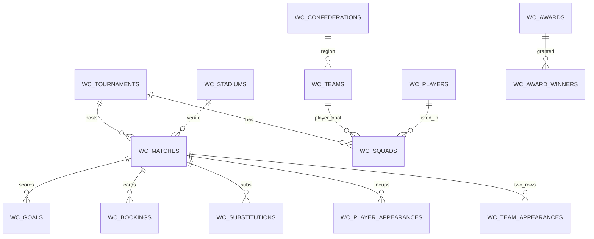

# 世界杯 CSV → Silver 层 ETL 规划方案

> **状态**：规划留底（2026-06-03）  
> **数据位置**：`data/bronze/worldcup/`（31 个 CSV，已就位）  
> **父史诗**：[EP04-01-worldcup-data-etl.md](../../tasks/epics/EP04-01-worldcup-data-etl.md)  
> **下游**：EP04 RAG（Gold 事实卡）· EP11 赛会分析 · 可选 Neo4j

---

## 1. 背景与目标

### 1.1 为什么要做

MemoryOS 后续需要：

- **RAG**：用结构化足球事实生成可读「事实卡」，供向量检索与对话溯源（EP04）。
- **赛会分析**：按 `tournament_id` 参数化的战力分、榜单、LangGraph 解读（EP11）。
- **可选知识图谱**：Neo4j 点边导入（独立 change，消费同一 Silver）。

原始 CSV **不能直接**进 pgvector 或图数据库：存在宽表冗余、双视角行、汇总表与明细表并存、男女世界杯混在同一库等问题。本方案交付 **Silver 规范化 PostgreSQL**，并轻量产出 **Gold 事实卡**（文本，不写向量）。

### 1.2 本阶段交付边界

| 交付 | 说明 |
| :--- | :--- |
| Bronze 元数据 | 文件 hash、行数、列 profile（`profile.py`） |
| Silver PG 表 | Alembic 迁移 + ETL loaders |
| 校验脚本 | 引用完整性 + 业务规则，`exit 1` 即失败 |
| 技术文档 | `docs/tech/worldcup-data-model.md`（实现阶段补 ER 图） |
| Gold 事实卡 | `data/gold/worldcup/fact_cards/` JSONL/Markdown 样例 |
| **非目标** | pgvector、Neo4j、前端页面、LLM 解读 |

### 1.3 盘点结论（已对 31 文件跑初步 profile）

- **总行数**：约 7.8 万行（最大表 `player_appearances` 27,432 行）。
- **时间跨度**：1930–2022，共 **30 届**（男子 22 + 女子 8，`tournaments.csv`）。
- **比赛**：`matches.csv` **1,248 场、每 match_id 唯一 1 行**（已归一 home/away）。
- **双行表**：`team_appearances.csv` 每场 **恰好 2 行**（球队视角），与 `matches` 比分 **0 不一致**。
- **外键抽检**：`squads`/`goals`/`bookings` → `players`/`teams`/`matches` **0 孤儿**；`matches` → `stadiums`/`tournaments` **0 孤儿**。
- **特殊行**：`replayed`/`replay` 标记比赛 **8 场**；需单独规则，不可当普通场次重复入库。

---

## 2. 资产清单与分层

### 2.1 文件总览（31 CSV）

| 层级 | 文件 | 行数 | 主键/粒度 | 备注 |
| :--- | :--- | ---: | :--- | :--- |
| **L0 赛会** | `tournaments.csv` | 30 | `tournament_id` | 含男女世界杯 |
| | `tournament_stages.csv` | 155 | `key_id` | 每届阶段元数据 |
| | `host_countries.csv` | 31 | `key_id` | 东道主与成绩 |
| **L1 维度** | `confederations.csv` | 6 | `confederation_id` | 大洲足联 |
| | `teams.csv` | 88 | `team_id` | `mens_team`/`womens_team` 标志 |
| | `players.csv` | 10,401 | `player_id` | 位置四列 0/1；`list_tournaments` 逗号年 |
| | `managers.csv` | 475 | `manager_id` | |
| | `referees.csv` | 493 | `referee_id` | 含 `confederation_id` |
| | `stadiums.csv` | 240 | `stadium_id` | 容量、wiki |
| | `awards.csv` | 8 | `award_id` | 奖项字典 |
| **L2 赛会结构** | `groups.csv` | 159 | `key_id` | 小组定义 |
| | `group_standings.csv` | 626 | `key_id` | 小组积分榜 |
| | `tournament_standings.csv` | 120 | `key_id` | 当届最终名次 |
| | `qualified_teams.csv` | 625 | `key_id` | 参赛队与当届表现 |
| **L3 比赛主表** | `matches.csv` | 1,248 | `match_id` | **canonical 1 行/场** |
| | `team_appearances.csv` | 2,496 | `key_id` | **2 行/场**，球队视角 |
| **L4 比赛事件** | `goals.csv` | 3,637 | `goal_id` | 含点球、乌龙 |
| | `bookings.csv` | 3,178 | `booking_id` | 黄/红牌 |
| | `substitutions.csv` | 10,222 | `substitution_id` | 上下场 |
| | `penalty_kicks.csv` | 396 | `penalty_kick_id` | 点球大战逐球 |
| | `player_appearances.csv` | 27,432 | `key_id` | 每场每球员出场 |
| | `manager_appearances.csv` | 2,538 | `key_id` | 每场教练 |
| | `referee_appearances.csv` | 1,248 | `key_id` | 每场裁判 |
| **L5 名单/任命** | `squads.csv` | 13,843 | `key_id` | 当届 squad |
| | `manager_appointments.csv` | 637 | `key_id` | 当届教练任命 |
| | `referee_appointments.csv` | 668 | `key_id` | 当届裁判名单 |
| | `award_winners.csv` | 200 | `key_id` | 当届奖项 |
| **L6 汇总（衍生）** | `goals-by-minute-summary.csv` | 90 | 时间段 | **无 tournament_id** |
| | `top-scorers-summary.csv` | 15 | 球员名 | 跨届聚合，弱键 |
| | `tournament-appearances.csv` | 20 | 队名 | 参赛次数统计 |
| | `tournament-goals-summary.csv` | 22 | `year` | 场均进球 |

### 2.2 实体关系（逻辑 ER）



**依赖加载顺序（拓扑）**：

```text
confederations → teams → players, managers, referees, stadiums, awards
       ↓
tournaments → tournament_stages, groups, qualified_teams
       ↓
matches（主表）
       ↓
team_appearances, squads, appointments
       ↓
goals, bookings, substitutions, penalty_kicks, *_appearances
       ↓
group_standings, tournament_standings, award_winners
       ↓
（可选）L6 汇总表 → materialized views 或跳过 Bronze 直导
```

---

## 3. 架构方案：Bronze → Silver → Gold

```text
┌─────────────────────────────────────────────────────────────┐
│ Bronze  data/bronze/worldcup/*.csv                          │
│         + bronze_file_manifest（hash, rows, profiled_at）    │
└───────────────────────────┬─────────────────────────────────┘
                            │ scripts/etl/worldcup/
                            ▼
┌─────────────────────────────────────────────────────────────┐
│ Silver  PostgreSQL（wc_* 表，Alembic）                       │
│         规范化 PK/FK、类型、枚举、去重规则                     │
└───────────────────────────┬─────────────────────────────────┘
                            │ fact_card_generator.py
                            ▼
┌─────────────────────────────────────────────────────────────┐
│ Gold    data/gold/worldcup/fact_cards/*.jsonl               │
│         人类可读摘要 → EP04 chunk + embed                    │
└─────────────────────────────────────────────────────────────┘
```

### 3.1 表命名约定

与 EP11 spec 对齐，统一前缀 **`wc_`**，避免与业务 `users`/`documents` 混淆：

| 表名 | 来源 | V1 优先级 |
| :--- | :--- | :---: |
| `wc_confederations` | confederations | P0 |
| `wc_teams` | teams | P0 |
| `wc_players` | players | P0 |
| `wc_player_tournament_years` | players.`list_tournaments` 展开 | P0 |
| `wc_tournaments` | tournaments | P0 |
| `wc_stadiums` | stadiums | P0 |
| `wc_matches` | matches | P0 |
| `wc_team_match_stats` | team_appearances | P1 |
| `wc_goals` | goals | P1 |
| `wc_squads` | squads | P1 |
| `wc_player_appearances` | player_appearances | P2 |
| `wc_bookings` | bookings | P2 |
| `wc_substitutions` | substitutions | P2 |
| `wc_penalty_kicks` | penalty_kicks | P2 |
| `wc_managers` / `wc_referees` / `wc_awards` | 维度 | P2 |
| `wc_*_appointments` / `wc_*_appearances` | 任命与出场 | P2 |
| `wc_group_standings` 等 | 赛会结构 | P2 |

**V1 最小可验收集（P0）**：能完整描述一届世界杯的「谁、哪场、几分」+ 球员维度。  
**V1.1（P1）**：进球、红黄牌、squad、球队视角统计。  
**V2（P2）**：教练/裁判/换人/点球细节 + 积分榜。

### 3.2 技术栈选型

| 组件 | 选择 | 理由 |
| :--- | :--- | :--- |
| 盘点/ETL 运行时 | **Python 3.11+**（与 `apps/api` 一致） | 可复用 SQLAlchemy models |
| CSV 读取 | **pandas** 或 **polars** | profile 快；matches 规模小，两者皆可 |
| 入库 | **SQLAlchemy 2 + Alembic** | 与 EP03 栈统一 |
| 脚本位置 | `scripts/etl/worldcup/` | 不改 `apps/api` 路由，离线 job |
| 校验 | 独立 `validate.py` | CI 可挂接；失败非 0 |

---

## 4. 核心思路

### 4.1 「一场比赛只有一个真相源」

**重要修正**（相对 EP04-01 史诗初稿）：

- 史诗曾假设 `matches.csv` 为双行宽表；**实测并非如此**。
- **`matches.csv` 已是 canonical 表**（`home_team_id` / `away_team_id` / 比分列齐全）。
- **`team_appearances.csv` 才是双行球队视角**，用于 `wc_team_match_stats`（主客中立字段：goals_for、win/lose/draw）。

ETL 策略：

1. **以 `matches` 为主写入 `wc_matches`**，不自己做双行合并。
2. **`team_appearances` 做校验 + 衍生**，验证每场 2 行且与 `matches` 比分一致（已验证 0 mismatch）。
3. 双行合并算法仍要 **单元测试**，但输入是 `team_appearances` 而非 `matches`。

### 4.2 多届 + 男女世界杯：用 `tournament_id` 贯穿

- 源 ID 格式：`WC-2022`、`WC-2019`（女子）等。
- EP11 期望 slug：`wc2022` — 在 Silver 增加 **`slug`** 列或映射表，ETL 时 `WC-2022` → `wc2022`。
- **V1 范围建议**：先 **男子世界杯 `mens_team=1` 过滤 + 黄金验收届 `WC-2022`**；女子数据入库但校验可分期。

### 4.3 球员 `list_tournaments` 是「参赛年份」不是 `tournament_id`

- 源字段为 `"1958, 1962"` 等 **四位年份**。
- 展开为 `wc_player_tournament_years(player_id, year)`，再 JOIN `wc_tournaments.year` 得 `tournament_id`。
- 校验：`count_tournaments` = 展开行数（允许 NULL 列表 → 0）。

### 4.4 汇总表（L6）不进入 Silver V1

`goals-by-minute-summary`、`top-scorers-summary` 等：

- 无稳定外键，可由 Silver **SQL 聚合重算**。
- Bronze 仅存档；避免「双真相源」。
- 若需缓存：PostgreSQL **物化视图** 或 EP11 stats 层再算。

### 4.5 宽表冗余列：入库时瘦身

多数事实表重复携带 `tournament_name`、`team_name`、`match_name` 等 **反范式列**（方便人类读 CSV）。

Silver 规则：

- **只存 ID + 必要 denorm**（如 `match_date` 常查可留）。
- 展示名通过 JOIN 视图 `v_wc_match_cards` 生成 Gold 事实卡。

### 4.6 Gold 事实卡（衔接 EP04）

按实体类型生成固定模板，例如：

```text
[Match] 2022 FIFA World Cup · Argentina vs France · Final · 2022-12-18
Score: 3-3 (ET), penalties 4-2. Stadium: Lusail. Goals: Messi (23', 108'), ...
Source: wc_matches M-2022-64 + wc_goals
```

输出：`fact_cards/matches.jsonl`、`players.jsonl`、`tournaments.jsonl`。  
EP04 将此视为 **预清洗文档** 走 chunk → embed，与 PDF 管线共用 `document_chunks`。

---

## 5. 关键点（设计决策）

| # | 关键点 | 决策 |
| :---: | :--- | :--- |
| 1 | 比赛主表 | **`matches.csv` → `wc_matches`**，不做双行合并 |
| 2 | 球队视角 | **`team_appearances` → `wc_team_match_stats`**，2 行/场 |
| 3 | 赛会 ID | 保留 `WC-YYYY`，另建 `slug` 供 API |
| 4 | 男女分离 | 维度表保留全部；校验/黄金集默认 **男子 + 2022** |
| 5 | 重赛 | `replayed=1` / `replay=1` 的 8 场：**保留原场 + 重赛场**，用 `parent_match_id` 或 `is_replay` 标志 |
| 6 | 点球 | `matches` 有 `penalty_shootout` + 比分列；细节用 `penalty_kicks` |
| 7 | 位置 | `players` 四列 0/1 → `positions text[]` + `primary_position` |
| 8 | Wiki 链接 | `not applicable` → NULL；URL 原样存 metadata |
| 9 | 日期 | 源已是 ISO（`1930-07-13`）；`players.birth_date` 同 |
| 10 | L6 汇总 | **不导入** Silver；可重算 |
| 11 | 幂等 ETL | `upsert` on 自然键（`match_id` 等）；记录 `bronze_file_hash` |
| 12 | EP11 对齐 | `wc_tournaments.slug` = `wc2022` 与 seed 目录一致 |

---

## 6. 难点与对策

### 6.1 难点：赛会/球队/球员跨届一致性

**现象**：同一 `team_id` 跨 30 届；`players.list_tournaments` 用年份字符串；部分球员仅女子世界杯。

**对策**：

- 维度表 **不按届复制**（`wc_teams` 全局唯一）。
- 赛会相关用 **桥表**：`wc_squads`、`wc_qualified_teams`、`wc_player_tournament_years`。
- 校验：每个 `squads.(tournament_id, player_id)` 应能在 `players` 找到；`squads.team_id` ∈ 当届 `qualified_teams`。

### 6.2 难点：重赛（replay）与场次计数

**现象**：8 场比赛带 `replayed`/`replay` 标记；`tournament_stages` 有 `count_replays`。

**对策**：

- 不删除重赛行；`wc_matches` 增加 `is_replay boolean`、`replay_of_match_id nullable`。
- 统计「当届总场次」以 `tournament_stages.count_matches` 交叉校验，而非简单 `COUNT(*)`。
- 单元测试覆盖至少 1 组 replay 样本。

### 6.3 难点：事件表时间字段

**现象**：`minute_label`（如 `45+2`）、`minute_regulation`、`minute_stoppage`、`match_period` 并存。

**对策**：

- Silver 存 **结构化分钟**：`minute_regulation int`、`minute_stoppage int`、`period enum`。
- `minute_label` 保留 raw 备查。
- 排序进球时间：先 `period`，再 `minute_regulation`，再 `minute_stoppage`。

### 6.4 难点：汇总表与明细表一致性

**现象**：`top-scorers-summary` 仅 15 行、用自由文本 `player` 列。

**对策**：

- V1 **不依赖** 该文件；用 `goals` 聚合验证「2022 金靴」可作为 Story 01.5 冒烟测试。
- 若不一致，以 **明细 `goals` 为准**。

### 6.5 难点：工作量与 EP04 抢排期

**现象**：31 张表 temptation 一次性建全。

**对策**：

- 严格 **P0 → P1 → P2** 分期；OpenSpec **一 change 一 PR**。
- P0 完成即可启动 EP04 事实卡嵌入；P1/P2 与 EP11 并行。

### 6.6 难点：大数据 Git 与可复现

**现象**：CSV 已 `.gitignore`；协作者无数据则 ETL 失败。

**对策**：

- `profile.py` 输出 **列统计 JSON** 进 Git（`data/bronze/worldcup/_profile/`）。
- CI 用 **subset fixture**（如 2022 单场样例 CSV 脱敏）跑 unit test。
- README 说明「本地放全量 CSV」。

---

## 7. 清洗规则摘要（按表）

### 7.1 `teams.csv`

- 过滤标志：`mens_team`/`womens_team`（V1 校验脚本参数 `--gender men`）。
- `confederation_*` 可冗余存储或仅留 `confederation_id` FK。
- Wikipedia：`not applicable` → `NULL`（实测 teams 3 条）。

### 7.2 `players.csv`

- `goal_keeper`…`forward` → `positions[]`；多选合法。
- `list_tournaments`：split `,` → trim → int year。
- `female`：保留；与男子黄金集校验时过滤。

### 7.3 `matches.csv`

- 比分：直接用 `home_team_score`/`away_team_score`（整数）。
- `score` 列含 Unicode 破折号 `–`，**不以字符串解析比分**。
- `extra_time`/`penalty_shootout`：0/1 → boolean。
- `stage_name` 标准化枚举：`group stage` → `group`，`round of 16` → `r16` 等（映射表配置化）。

### 7.4 `team_appearances.csv`

- 每场必须 2 行；`team_id`/`opponent_id` 互斥互补。
- `goals_for`/`goals_against` 与 `matches` 交叉校验（全库已 0 错）。

### 7.5 事件表（goals / bookings / substitutions）

- 统一引用 `match_id`、`player_id`、`team_id`。
- `own_goal`、`penalty`、`yellow_card` 等 0/1 → boolean。
- `player_appearances`：`starter`/`substitute` 0/1 → boolean；`position_code` 枚举校验。

---

## 8. 实施路线

### 8.1 OpenSpec Change 拆分（建议顺序）

| 顺序 | Change | 内容 | 风险 |
| :---: | :--- | :--- | :---: |
| 1 | `ep04-01-wc-profile` | 31 文件 manifest + `_profile/report.md` | 低 |
| 2 | `ep04-01-wc-dim-teams` | confederations, teams, tournaments, stadiums | 低 |
| 3 | `ep04-01-wc-players` | players + player_tournament_years | 中 |
| 4 | `ep04-01-wc-matches` | matches + team_appearances + 重赛规则 | **中** |
| 5 | `ep04-01-wc-events` | goals, bookings, squads（P1） | 中 |
| 6 | `ep04-01-wc-validate` | 校验脚本 + `worldcup-data-model.md` | 低 |
| 7 | `ep04-01-wc-fact-cards` | Gold JSONL + 10 条人工 spot-check | 低 |

原史诗中的 Story 01.4「matches 双行合并」改为 **「matches 直导 + team_appearances 校验」**。

### 8.2 脚本目录结构（规划）

```text
scripts/etl/worldcup/
├── profile.py           # Bronze 盘点 → _profile/
├── loaders/
│   ├── base.py          # upsert、session、hash 检查
│   ├── dimensions.py
│   ├── players.py
│   ├── matches.py
│   └── events.py
├── run.py               # --edition WC-2022 --phase p0
├── validate.py          # 引用 + 业务规则
└── fact_cards.py        # Silver → Gold
```

### 8.3 校验清单（`validate.py` 必含）

**引用完整性**

- [ ] `wc_matches.home/away_team_id` ∈ `wc_teams`
- [ ] `wc_matches.stadium_id` ∈ `wc_stadiums`
- [ ] `wc_goals.match_id` ∈ `wc_matches`
- [ ] `wc_squads.player_id` ∈ `wc_players`

**业务规则**

- [ ] 每场 `team_appearances` 恰好 2 行
- [ ] `team_appearances` 比分与 `matches` 一致
- [ ] `players.count_tournaments` = `player_tournament_years` 行数
- [ ] 当届 `qualified_teams` 队数 = `tournaments.count_teams`（允许文档化例外）
- [ ] `WC-2022` 决赛存在且比分与常识一致（冒烟）

**参数**

```bash
python scripts/etl/worldcup/validate.py --tournament WC-2022 --gender men
```

---

## 9. 验收标准

| 级别 | 条件 |
| :--- | :--- |
| **P0 完成** | `WC-2022` 男子赛会：teams/players/matches/stadiums 入库；`validate` 0 错误 |
| **文档** | `worldcup-data-model.md` 与 Alembic migration 一致 |
| **事实卡** | ≥10 条 match/player 卡人工读通；含 `source_ids` 可回溯 |
| **可复现** | 同 Bronze hash 重跑 ETL 结果行数不变（幂等） |
| **EP04 就绪** | `data/gold/worldcup/fact_cards/` 可被 document loader 读取 |

---

## 10. 与下游史诗衔接

```text
EP04-01 Silver + Gold 事实卡
        │
        ├─→ EP04 RAG：chunk / embed / 检索 / 对话溯源
        │
        ├─→ EP11 Sports：wc_tournaments.slug + stats 物化（战力分）
        │
        └─→ Neo4j（可选）：由 Silver 导出 MATCH/PLAYED/SCORED 边
```

EP11 当前 seed 设计为 `apps/api/data/seed/wc2022/` — **长期应改为读 Silver 或导出 JSON**；ETL 完成后可增加 `export_seed.py` 生成同结构 JSON，避免双维护。

---

## 11. 风险登记

| 风险 | 影响 | 缓解 |
| :--- | :--- | :--- |
| 史诗与真数据 schema 不符 | 错误估工时 | 本文档已修正；回写 EP04-01 链接 |
| 女子世界杯混入男子统计 | 战力分/RAG 答案错误 | 校验 `--gender`；API 层 `tournament_id` 隔离 |
| 31 表一次建全 | 延期 EP04 | P0/P1/P2 强制分期 |
| 无 CSV 的 CI | 测试空洞 | fixture 小样 + profile JSON 进 Git |
| `list_tournaments` 年份无对应届 | JOIN 失败 | LEFT JOIN + 校验报告 warn，不 hard fail |

---

## 12. 建议的下一步

1. **人审本规划** — 确认 V1 范围（是否仅男子、黄金集是否 `WC-2022`）。
2. **`/opsx:propose ep04-01-wc-profile`** — 第一个 change，只产出 manifest + profile 报告。
3. 实现 P0 loaders 后，即可并行起草 EP04 的 document loader 适配 `fact_cards`。

---

## 附录 A：各 CSV 列清单（速查）

<details>
<summary>点击展开完整表头</summary>

| 文件 | 列 |
| :--- | :--- |
| award_winners | key_id, tournament_id, tournament_name, award_id, award_name, shared, player_id, family_name, given_name, team_id, team_name, team_code |
| awards | key_id, award_id, award_name, award_description, year_introduced |
| bookings | key_id, booking_id, tournament_id, tournament_name, match_id, match_name, match_date, stage_name, group_name, team_id, team_name, team_code, home_team, away_team, player_id, family_name, given_name, shirt_number, minute_label, minute_regulation, minute_stoppage, match_period, yellow_card, red_card, second_yellow_card, sending_off |
| confederations | key_id, confederation_id, confederation_name, confederation_code, confederation_wikipedia_link |
| goals-by-minute-summary | minute_start, minute_end, goal_count |
| goals | key_id, goal_id, tournament_id, tournament_name, match_id, match_name, match_date, stage_name, group_name, team_id, team_name, team_code, home_team, away_team, player_id, family_name, given_name, shirt_number, player_team_id, player_team_name, player_team_code, minute_label, minute_regulation, minute_stoppage, match_period, own_goal, penalty |
| group_standings | key_id, tournament_id, tournament_name, stage_number, stage_name, group_name, position, team_id, team_name, team_code, played, wins, draws, losses, goals_for, goals_against, goal_difference, points, advanced |
| groups | key_id, tournament_id, tournament_name, stage_number, stage_name, group_name, count_teams |
| host_countries | key_id, tournament_id, tournament_name, team_id, team_name, team_code, performance |
| manager_appearances | key_id, tournament_id, tournament_name, match_id, match_name, match_date, stage_name, group_name, team_id, team_name, team_code, home_team, away_team, manager_id, family_name, given_name, country_name |
| manager_appointments | key_id, tournament_id, tournament_name, team_id, team_name, team_code, manager_id, family_name, given_name, country_name |
| managers | key_id, manager_id, family_name, given_name, female, country_name, manager_wikipedia_link |
| matches | key_id, tournament_id, tournament_name, match_id, match_name, stage_name, group_name, group_stage, knockout_stage, replayed, replay, match_date, match_time, stadium_id, stadium_name, city_name, country_name, home_team_id, home_team_name, home_team_code, away_team_id, away_team_name, away_team_code, score, home_team_score, away_team_score, home_team_score_margin, away_team_score_margin, extra_time, penalty_shootout, score_penalties, home_team_score_penalties, away_team_score_penalties, result, home_team_win, away_team_win, draw |
| penalty_kicks | key_id, penalty_kick_id, tournament_id, tournament_name, match_id, match_name, match_date, stage_name, group_name, team_id, team_name, team_code, home_team, away_team, player_id, family_name, given_name, shirt_number, converted |
| player_appearances | key_id, tournament_id, tournament_name, match_id, match_name, match_date, stage_name, group_name, team_id, team_name, team_code, home_team, away_team, player_id, family_name, given_name, shirt_number, position_name, position_code, starter, substitute |
| players | key_id, player_id, family_name, given_name, birth_date, female, goal_keeper, defender, midfielder, forward, count_tournaments, list_tournaments, player_wikipedia_link |
| qualified_teams | key_id, tournament_id, tournament_name, team_id, team_name, team_code, count_matches, performance |
| referee_appearances | key_id, tournament_id, tournament_name, match_id, match_name, match_date, stage_name, group_name, referee_id, family_name, given_name, country_name, confederation_id, confederation_name, confederation_code |
| referee_appointments | key_id, tournament_id, tournament_name, referee_id, family_name, given_name, country_name, confederation_id, confederation_name, confederation_code |
| referees | key_id, referee_id, family_name, given_name, female, country_name, confederation_id, confederation_name, confederation_code, referee_wikipedia_link |
| squads | key_id, tournament_id, tournament_name, team_id, team_name, team_code, player_id, family_name, given_name, shirt_number, position_name, position_code |
| stadiums | key_id, stadium_id, stadium_name, city_name, country_name, stadium_capacity, stadium_wikipedia_link, city_wikipedia_link |
| substitutions | key_id, substitution_id, tournament_id, tournament_name, match_id, match_name, match_date, stage_name, group_name, team_id, team_name, team_code, home_team, away_team, player_id, family_name, given_name, shirt_number, minute_label, minute_regulation, minute_stoppage, match_period, going_off, coming_on |
| team_appearances | key_id, tournament_id, tournament_name, match_id, match_name, stage_name, group_name, group_stage, knockout_stage, replayed, replay, match_date, match_time, stadium_id, stadium_name, city_name, country_name, team_id, team_name, team_code, opponent_id, opponent_name, opponent_code, home_team, away_team, goals_for, goals_against, goal_differential, extra_time, penalty_shootout, penalties_for, penalties_against, result, win, lose, draw |
| teams | key_id, team_id, team_name, team_code, mens_team, womens_team, federation_name, region_name, confederation_id, confederation_name, confederation_code, mens_team_wikipedia_link, womens_team_wikipedia_link, federation_wikipedia_link |
| top-scorers-summary | player, team_name, goals |
| tournament-appearances | team_name, appearances |
| tournament-goals-summary | year, tournament_name, avg_goals_per_game |
| tournament_stages | key_id, tournament_id, tournament_name, stage_number, stage_name, group_stage, knockout_stage, unbalanced_groups, start_date, end_date, count_matches, count_teams, count_scheduled, count_replays, count_playoffs, count_walkovers |
| tournament_standings | key_id, tournament_id, tournament_name, position, team_id, team_name, team_code |
| tournaments | key_id, tournament_id, tournament_name, year, start_date, end_date, host_country, winner, host_won, count_teams, group_stage, second_group_stage, final_round, round_of_16, quarter_finals, semi_finals, third_place_match, final |

</details>

---

## 附录 B：初步数据质量报告（2026-06-03 跑数）

| 检查项 | 结果 |
| :--- | :--- |
| `matches` 每 `match_id` 唯一 | ✅ 1,248 / 1,248 |
| `team_appearances` 每 `match_id` 恰好 2 行 | ✅ 0 异常 |
| `team_appearances` 比分 vs `matches` | ✅ 0 mismatch |
| `goals` → `matches` 孤儿 | ✅ 0 |
| `squads` → `players` 孤儿 | ✅ 0 |
| `matches` → `teams` 孤儿 | ✅ 0 |
| 重赛标记场次 | ⚠️ 8 场（需规则） |
| 男女分布（matches） | 男子约 964，女子约 284 |
| 球员 `female=1` | 1,919 / 10,401 |
