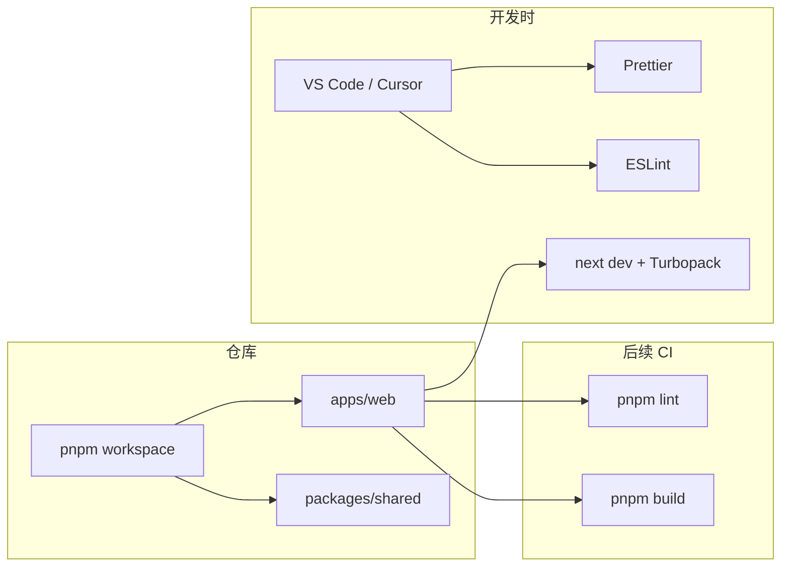

# MemoryOS 前端工程化方案

> 记录当前 **已落地** 与 **规划中**
> 的前端工程能力，便于学习、回顾与 onboarding。  
> 对应代码目录：`apps/web`、`packages/shared`、`packages/ui`。

**文档版本**：2026-05（Story 1.3 完成后）  
**前端版本**：`next@15.5.18`、`react@19.1.0`（以 `apps/web/package.json` 为准）  
**维护建议**：每完成一个 EP（如 EP02 流式对话）后，更新「规划栈」与「目录约定」章节。

---

## 1. 总览

```
memoryOS（pnpm Monorepo）
├── apps/web          ← Next.js 15 主应用（本文重点）
├── packages/shared   ← 跨端类型、常量、工具（无 React 依赖）
└── packages/ui       ← 公共 React 组件（EP02+ 逐步填充）
```

| 维度          | 选型                                |   状态    |
| :------------ | :---------------------------------- | :-------: |
| 包管理 / 仓库 | pnpm workspace Monorepo             |    ✅     |
| 框架          | Next.js 15（App Router）            |    ✅     |
| UI 运行时     | React 19                            |    ✅     |
| 语言          | TypeScript 5（`strict: true`）      |    ✅     |
| 样式          | Tailwind CSS v4                     |    ✅     |
| 代码检查      | ESLint 9（Flat Config）             |    ✅     |
| 代码格式化    | Prettier 3 + Tailwind 插件          |    ✅     |
| 构建加速      | Turbopack dev（`next dev --turbopack`）；build 默认 Webpack @15.5 | ✅ |
| API 客户端    | `lib/api-client.ts` + Bearer        |    ✅ EP03.4 |
| 状态管理      | Zustand                             |  📋 EP02  |
| 流式通信      | Vercel AI SDK `useChat` + BFF `/api/chat` |    ✅ EP02  |
| RAG 流升级    | BFF TextStream → Data Stream（`ep04-rag-chat-stream`） | ✅ 见 [`chat-rag-stream.md`](./chat-rag-stream.md) |
| 服务端状态    | TanStack Query（`@tanstack/react-query`） |    ✅ EP02  |
| 富文本        | react-markdown + 高亮               |  📋 EP02  |
| 单元测试      | —                                   | ❌ 未选型 |
| E2E           | —                                   | ❌ 未选型 |
| CI 前端流水线 | —                                   |  📋 EP08  |

---

## 2. Monorepo：pnpm workspace

### 是什么

在**一个 Git 仓库**内管理多个 npm 包：`apps/web` 与 `packages/*` 通过
`workspace:*` 协议互相引用，依赖在根目录统一安装、去重。

### 项目中的配置

| 文件                         | 作用                                                      |
| :--------------------------- | :-------------------------------------------------------- |
| 根目录 `pnpm-workspace.yaml` | 声明 `apps/web`、`packages/*` 为 workspace 成员           |
| 根目录 `package.json`        | 聚合脚本：`pnpm dev:web`、`pnpm build`、`pnpm lint`       |
| `apps/web/package.json`      | `"@memoryos/shared": "workspace:*"`                       |
| `apps/web/next.config.ts`    | `transpilePackages: ["@memoryos/shared", "@memoryos/ui"]` |

### 优势

- 前后端类型、常量一处定义（`@memoryos/shared`），减少拷贝与不一致。
- 单次 `pnpm install` 安装全仓依赖，磁盘占用小于多仓库各装一份 `node_modules`。
- 根脚本可统一驱动 lint / build，适合后续 CI。

### 劣势 / 注意点

- 新人需理解「在根目录装依赖 vs 在子包装依赖」：业务依赖一般写在
  `apps/web`，共享逻辑写在 `packages/*`。
- `apps/api` 为 Python，**不在** pnpm workspace 内，前后端仅通过 HTTP 协作。
- 锁文件 `pnpm-lock.yaml` 在根目录维护；子包单独 `npm install`
  容易破坏 workspace 链接。

### 常用命令（均在仓库根目录执行）

#### 安装

```bash
pnpm install                                    # 按 pnpm-lock.yaml 安装全 workspace
pnpm setup:api                                  # Python API（Conda memoryos-api 或 .venv）
pnpm install:all                                # install + setup:api 一次做完
```

#### 给指定子包加依赖

```bash
pnpm --filter @memoryos/web add zustand         # 写入 apps/web/package.json
pnpm --filter @memoryos/shared add lodash-es    # 写入 packages/shared/package.json
pnpm --filter @memoryos/ui add clsx             # 写入 packages/ui/package.json
```

加 **开发依赖** 时加 `-D`：

```bash
pnpm --filter @memoryos/web add -D @types/node
```

#### 启动

```bash
pnpm dev                  # 同 dev:stack：db:up + 前后端
pnpm dev:stack            # PostgreSQL + dev:web + dev:api
pnpm db:up                # 仅 Docker Postgres（EP03）
pnpm dev:web              # 前端 http://localhost:3000
pnpm dev:api              # 后端 http://localhost:8000
pnpm dev:all              # 仅前后端（需已 pnpm db:up）
pnpm --filter @memoryos/web build
pnpm -r run lint          # 所有 workspace 包执行 lint
```

**端口占用**（`Address already in use`、:3000 / :8000）：见 [daily-playbook §7](../team/daily-playbook.md#7-本地-dev-排障端口占用)。

#### API（Python，非 pnpm workspace）

本地已有 Conda 环境 **`memoryos-api`** 时：

| 场景 | 命令 |
|:-----|:-----|
| 日常启动 | `pnpm dev:api` 即可（脚本用 `conda run -n memoryos-api`，无需每次 `conda activate`） |
| 首次克隆 / 换机器 | `pnpm setup:api` |
| 改了 `apps/api/requirements.txt` | 再跑一次 `pnpm setup:api` |

### 多个 workspace 都要用同一个包（如 zustand）

**不能**指望「装到根目录一次，所有子包自动能用」。pnpm 要求：**谁 `import`，谁的 `package.json` 里就要声明依赖**（或从已声明该依赖的 workspace 包再导出）。

| 做法 | 适用 | 说明 |
|:-----|:-----|:-----|
| **只装在 `apps/web`** | 仅页面/路由用状态 | EP02 聊天状态放 web 即可：`pnpm --filter @memoryos/web add zustand` |
| **装在 `packages/ui`** | 多个 UI 组件共用 store/hooks | `pnpm --filter @memoryos/ui add zustand`，web 通过 `@memoryos/ui` 使用 |
| **装在 `packages/shared`** | 仅当 store 与 React 无关（少见） | shared 应保持无 React；zustand 一般不放 shared |
| **根目录 `pnpm add -w zustand`** | 工具链、脚本 | `-w` = workspace root，**不会**自动让 `@memoryos/web` 能 import |

pnpm 会在磁盘上**去重**同版本依赖，各子包各写一条 `dependencies` 不会重复下载多份，但 **package.json 必须各自声明**（或集中在一个中间包声明一次）。

**推荐（MemoryOS）**：EP02 流式对话状态 → 先只加在 `@memoryos/web`；若 `packages/ui` 里也有组件要读 store，再在 `@memoryos/ui` 加 zustand，并把 store 定义放在 `packages/ui` 或 `apps/web/stores` 一处，避免两套 store。

---

## 3. Next.js 15 + App Router

### 是什么

基于 React 的全栈框架：**文件系统路由**（`app/`
目录）、服务端/客户端组件、内置构建与优化。

### 项目中的配置

| 项       | 说明                                                                                |
| :------- | :---------------------------------------------------------------------------------- |
| 版本     | `next@15.5.18`                                                                      |
| 路由     | `app/layout.tsx`（根布局）、`app/page.tsx`（`/`）、`app/not-found.tsx`、`app/chat/` |
| 开发     | `next dev --turbopack`（**15.5 稳定**）                                               |
| 生产构建 | `next build` → **Webpack 默认**；可选 `next build --turbopack`（**15.5 Beta**）     |
| 启动     | `next start`（配合 `output: "standalone"` 见 §3.3）                                   |
| 路径别名 | `tsconfig.json`：`"@/*": ["./*"]`                                                   |

### 优势

- App Router 与 React Server Components 契合 AI 类产品（首屏、SEO、按需流式）。
- 与 Vercel 生态一致，部署文档丰富。
- 开发命令使用 **Turbopack**（见下文 §3.1）。

### 劣势 / 注意点

- App Router 心智负担高于 Pages Router（Server / Client
  Component 边界，见 §3.2）。
- 大版本升级（14→15）需关注 breaking changes。
- 自建部署需理解 **`standalone` 输出**（见 §3.3，EP08 Docker）。

### 3.1 Turbopack 与 Webpack（按 Next.js 版本）

| Next.js | 开发 `next dev` | 生产 `next build` |
|:--------|:----------------|:------------------|
| **15.0** | Turbopack 稳定 | Webpack 默认 |
| **15.5**（**本项目**） | `--turbopack` | **Webpack 默认**；`--turbopack` 为 **Beta** |
| **16.0+** | Turbopack 默认 | Turbopack 默认；`--webpack` 回退 |

验证方式（本机）：

```bash
cd apps/web
pnpm exec next build          # 标题应为 Next.js 15.5.18（无 Turbopack）
pnpm exec next build --turbopack  # 标题应为 Next.js 15.5.18 (Turbopack)
```

升级 **Next 16** 后需改脚本：默认可能不再需要 `--turbopack`；若依赖 `webpack()` 自定义需迁 `turbopack` 配置或显式 `--webpack`。

### 3.1.1 为什么 Turbopack 开发时 HMR 通常快于 Webpack？

| 维度     | Webpack dev（传统）  | Turbopack（`next dev --turbopack`） |
| :------- | :------------------- | :---------------------------------- |
| 语言实现 | 以 JavaScript 为主   | **Rust** 实现核心打包与增量图更新   |
| 增量策略 | 常需较大依赖图重算   | 按**模块级**增量，只重编译变更链    |
| HMR 路径 | loader/plugin 链较长 | 与 Next 集成，热更新路径更短        |
| 冷启动   | 大项目首启偏慢       | 大仓库 Monorepo 下冷启通常更快      |

**HMR（Hot Module
Replacement）**：改代码后只替换受影响模块，不整页刷新，保留 React 状态。

Turbopack 快的原因可概括为：

1. **更少的无效工作**：变更文件时，只追踪其依赖子图，而非频繁全量 rebundle。
2. **原生性能**：解析、转换在 Rust 侧完成，CPU 密集步骤比纯 JS bundler 更高效。
3. **与 Next
   15 深度集成**：路由、Server/Client 边界由框架告知，减少通用 bundler 的猜测成本。

**注意（`next@15.5.18`）**：

- **开发**：推荐 `next dev --turbopack`（本项目已启用）。
- **生产**：`package.json` 中 `next build` 为 **Webpack**；若 CI 要试 Turbopack，改为 `next build --turbopack` 并做全量回归（仍为 Beta）。
- **Next 16+**：生产默认改为 Turbopack，本文档需同步更新。

不兼容时：dev 可临时 `next dev --webpack` 对比排查。

更完整对比：[knowledge/vite-vs-turbopack.md](./knowledge/vite-vs-turbopack.md)、[nextjs15.md](./knowledge/nextjs15.md)。

### 3.2 Server / Client Component：我们需要吗？算 SSR 方案吗？

**需要，且已经在用。** App Router 下**默认每个组件都是 Server
Component**，除非文件顶部写 `'use client'`。

| 类型                 | 运行位置                   | MemoryOS 典型用途                                               |
| :------------------- | :------------------------- | :-------------------------------------------------------------- |
| **Server Component** | Node 服务端（构建/请求时） | 布局、静态说明页、后续带鉴权的初始数据拉取                      |
| **Client Component** | 浏览器                     | 聊天输入、Zustand、SSE 流式、`useState` / `useEffect`、事件监听 |

**这是不是「SSR 开发方案」？**

- **更准确的说法**：Next.js 默认是 **React Server Components + 按需渲染**
  模型，而不是「全程 CSR 单页」。
- **SSR**：首屏 HTML 在服务端生成（SEO、更快首屏）。Marketing 页、会话列表初始数据适合 SSR。
- **CSR 片段**：流式 Token、输入框、Markdown 实时更新必须在 Client Component。
- **本项目（AI 对话）**：主体交互是 **CSR（客户端）** +
  **后端 SSE**；框架层仍受益于 Server Component 减少发到浏览器的 JS（例如静态
  `layout`、未加 `'use client'` 的页面壳）。

**EP02 起建议约定**（可写入组件文件头注释）：

```
app/page.tsx、layout.tsx     → 默认 Server（无 'use client'）
components/chat/*           → 必须 'use client'（Zustand、流式、DOM）
packages/ui/*               → 默认 Client（交互组件）
packages/shared/*           → 纯 TS，无 React
```

**结论**：不必「全盘 SSR」；采用 **「服务端壳 + 客户端交互岛」**
即可，这也是 Next 15 App Router 的推荐用法。

### 3.3 自建部署：`standalone` 是什么？

生产环境若 **不用 Vercel**，而是用 Docker / 自有服务器，应在 `next.config.ts`
中开启：

```ts
const nextConfig = {
  output: "standalone",
};
```

**`next build` 之后会发生什么？**

1. 常规 `.next/` 构建产物之外，额外生成 **`.next/standalone/`** 目录。
2. 该目录包含：
   - 裁剪后的 **`server.js`**（Node 入口）
   - 运行所需的最小 **`node_modules`**（仅生产依赖子集）
   - 你的应用代码编译结果
3. 静态资源仍需单独拷贝：将 `.next/static` →
   `standalone/.next/static`，`public/` →
   `standalone/public/`（Dockerfile 多阶段里常见三步）。

**为什么需要 standalone？**

| 对比        | 普通 `next start`                  | `standalone`             |
| :---------- | :--------------------------------- | :----------------------- |
| 部署单元    | 依赖整个项目根 + 完整 node_modules | **一个文件夹**即可起服务 |
| Docker 镜像 | 体积大、层多                       | 多阶段构建后镜像**更小** |
| 与 Monorepo | 易误带 workspace 无关包            | 只打包该 app 运行时依赖  |

**心智模型**：standalone
= 「把 Next 生产服务器及其最小依赖打成一个可搬运的运行包」，适合 EP08 的
`apps/web/Dockerfile`。

```dockerfile
# 概念示例（EP08 细化）
COPY --from=builder /app/apps/web/.next/standalone ./
COPY --from=builder /app/apps/web/.next/static ./.next/static
COPY --from=builder /app/apps/web/public ./public
CMD ["node", "server.js"]
```

---

## 4. TypeScript

### 项目中的配置

- `strict: true`：空值、隐式 any 等更严格。
- `moduleResolution: "bundler"`：适配 Next 打包器。
- `jsx: "preserve"`：由 Next 编译 JSX。
- 工作区包以**源码**形式被引用（`packages/shared/src/index.ts`），由 Next
  `transpilePackages` 编译。

### 优势

- 与 API 契约、共享类型对齐，减少运行时类型错误。
- IDE 跳转、重构体验好。

### 劣势 / 注意点

- 共享包若未单独跑 `tsc`，类型错误可能只在 `apps/web` build 时暴露。
- 后续 EP02 建议为 `@memoryos/shared` 补充独立 `tsc --noEmit` 或统一根脚本。

---

## 5. Tailwind CSS v4

### 是什么

Utility-first CSS；**v4** 将大量主题配置迁入 CSS，通过 PostCSS 插件接入。

### 项目中的配置

| 文件                 | 作用                                                         |
| :------------------- | :----------------------------------------------------------- |
| `app/globals.css`    | `@import "tailwindcss"`、`@theme inline` 定义颜色/字体 token |
| `postcss.config.mjs` | 插件 `@tailwindcss/postcss`                                  |
| `tailwind.config.ts` | `content` 扫描路径（含 `packages/ui`）                       |
| `.prettierrc`        | `prettier-plugin-tailwindcss` 自动排序 class                 |

### 优势

- 样式与组件同文件，迭代快，适合聊天、知识库等 UI 密集场景。
- v4 配置更贴近 CSS，主题切换（如暗色）可在 `:root` 统一维护。
- 与 Prettier 插件配合，class 顺序一致，减少 PR 噪音。

### 劣势 / 注意点

- v4 与 v3 文档/示例不完全通用，查资料需标明版本。
- 复杂动画或高度定制组件仍可能需要单独 CSS Module。
- `content` 需包含 monorepo 内 `packages/ui`，否则 purge 可能误删样式。

---

## 6. ESLint 9（Flat Config）

### 是什么

静态分析工具：在提交前发现逻辑错误、不良模式、Next/React 专项规则。

### 项目中的配置

| 路径                                | 作用                                                                     |
| :---------------------------------- | :----------------------------------------------------------------------- |
| 根目录 `eslint.shared.mjs`          | **共享规则**：`semi`、`no-unused-vars` warn、`no-console` off 等         |
| `apps/web/eslint.config.mjs`        | Next 规则 + `prettier` + `sharedRules` + `@next/next/no-img-element` off |
| `packages/shared/eslint.config.mjs` | `typescript-eslint` + `sharedRules`                                      |
| `packages/ui/eslint.config.mjs`     | `typescript-eslint` + `react-hooks` + `sharedRules`                      |

**引号 / 缩进**：由 **Prettier** 统一（`singleQuote: false` 即双引号）。ESLint
**不配置 `quotes`**，避免与 Prettier 冲突。

### 优势

- 与 Next 官方规则对齐（图片、Hook、性能相关）。
- Monorepo 内 `packages/*` 与 `apps/web`
  **同一套语义规则**，仅 Next 专属规则留在 web。
- Flat Config 是 ESLint 未来默认形态，扩展清晰。

### 劣势 / 注意点

- Flat + `FlatCompat`（web）配置略冗长，升级 `eslint-config-next` 时需回归测试。
- `@memoryos/ui` 使用 `react-hooks` 而非
  `eslint-config-next`（包内无 Next 环境）。

### 命令

```bash
pnpm lint                              # 根目录：web + shared + ui
pnpm --filter @memoryos/shared lint
pnpm --filter @memoryos/web lint
```

---

## 7. Prettier

### 是什么

**只负责格式**（缩进、引号、换行、尾逗号），不负责语义；与 ESLint 分工明确。

### 项目中的配置

| 文件                       | 关键项                                                               |
| :------------------------- | :------------------------------------------------------------------- |
| `apps/web/.prettierrc`     | `semi: true`、`singleQuote: false`（双引号）、`trailingComma: "all"` |
| `apps/web/.prettierignore` | 忽略 `.next`、`node_modules` 等                                      |
| 插件                       | `prettier-plugin-tailwindcss`                                        |

### 优势

- 团队无需争论格式，保存即一致。
- Tailwind 插件按推荐顺序排列 class，可读性更好。

### 劣势 / 注意点

- 与 ESLint 若未用
  `eslint-config-prettier`，会出现「修 ESLint 又被 Prettier 改回」的打架；本项目已通过
  `prettier` extend 缓解。
- 格式化全量 `pnpm format` 时留意不要扫到生成物目录。

---

## 8. 编辑器集成（VS Code / Cursor）

### 项目中的配置

`.vscode/settings.json`（仓库级，团队可共享）：

| 配置项                                          | 含义                          |
| :---------------------------------------------- | :---------------------------- |
| `editor.formatOnSave`                           | 保存时用 Prettier 格式化      |
| `editor.codeActionsOnSave.source.fixAll.eslint` | 保存时 ESLint 自动修复        |
| `editor.defaultFormatter`                       | Prettier 扩展                 |
| `prettier.singleQuote: false`                   | 与 `.prettierrc` 一致：双引号 |

根目录 `.editorconfig`：UTF-8、LF、缩进 2 空格（与 Prettier 一致）。

### 推荐安装的扩展

- [ESLint](https://marketplace.visualstudio.com/items?itemName=dbaeumer.vscode-eslint)
- [Prettier](https://marketplace.visualstudio.com/items?itemName=esbenp.prettier-vscode)
- [Tailwind CSS IntelliSense](https://marketplace.visualstudio.com/items?itemName=bradlc.vscode-tailwindcss)

### 优势

- 保存即合规，降低 code review 格式讨论成本。

### 劣势 / 注意点

- 未装扩展时仅靠 CLI `lint` / `format`，体验不一致。
- 个人全局 Prettier 配置可能覆盖工作区，建议启用「使用工作区配置」。

---

## 9. 环境变量

| 文件                    | 说明                                               |
| :---------------------- | :------------------------------------------------- |
| `apps/web/.env.example` | 模板，可提交 Git                                   |
| `apps/web/.env.local`   | 本地私密配置，**不提交**（根 `.gitignore` 已忽略） |

| 变量                  | 用途                      |
| :-------------------- | :------------------------ |
| `NEXT_PUBLIC_API_URL` | 后端 API 基址，浏览器可读 |

命名约定：仅暴露给浏览器的变量必须以 `NEXT_PUBLIC_` 开头。

---

## 10. 规划中的前端能力（尚未落地）

来自 [任务中心](../tasks/README.md)，完成 EP 后应回写本文档。

| 能力     | 计划选型                                 | 典型场景                       |
| :------- | :--------------------------------------- | :----------------------------- |
| 状态管理 | Zustand                                  | 会话列表、流式 loading、错误态 |
| 流式     | `lib/sse-client.ts`（`streamChatCompletion`） | `/chat` 最小页；完整 UI 在 `ep02-chat-ui` |
| Markdown | react-markdown + rehype/shiki            | 助手消息、代码块               |
| 长列表   | 虚拟滚动（如 `@tanstack/react-virtual`） | 历史消息、文档列表             |
| 上传     | 分片 + 进度                              | 知识库 PDF（EP04）             |

---

## 11. 推荐目录约定（随 EP 演进）

```
apps/web/
├── app/                 # 路由与页面（App Router）
├── components/          # 仅 web 使用的业务组件
├── lib/                 # `api-client.ts`、`auth-token.ts`、`sse-frames.ts`、`memoryos-upstream.ts`
├── app/api/chat/        # BFF：MemoryOS SSE → AI SDK 文本流（RAG structured 升级见 docs/tech/chat-rag-stream.md）
├── stores/              # Zustand stores（`ep02-chat-ui`）
├── hooks/               # React Query hooks、后续 chat hooks
└── public/              # 静态资源
```

跨应用复用放 `packages/ui`，与 UI 无关的 types/constants 放 `packages/shared`。

---

## 12. 工具链协作关系（一图流）



---

## 13. 全仓库协作规范（含后端）

前端工程细节见本文；**Git 分支、Conventional Commits、PR 流程**前后端共用
[CONTRIBUTING.md](../../CONTRIBUTING.md)：

| 项           | 约定                                                                      |
| :----------- | :------------------------------------------------------------------------ |
| 分支         | `main`、`feat/*`、`fix/*`、`docs/*`、`chore/*`                            |
| 提交         | `feat(web): ...` / `feat(api): ...` / `fix(api): ...`                     |
| 后端代码风格 | Python 4 空格；路由 → Service → Repository（见 `BE-engineering.md` 待写） |

后端不单独维护一套 Git 规范；仅在 **scope** 上用 `api` 区分。

---

## 14. 待补充项（建议你后续完善）

以下内容**当前仓库未完全定稿**，适合作为你的「补充清单」：

| 类别              | 建议补充                                         | 说明                                                                      |
| :---------------- | :----------------------------------------------- | :------------------------------------------------------------------------ |
| **测试**          | Vitest + React Testing Library？Playwright E2E？ | 选定后写「测试命令 + 目录约定」                                           |
| **Git Hooks**     | Husky + lint-staged                              | `commit` 前自动 lint/format，与 CONTRIBUTING 中 Conventional Commits 联动 |
| **组件文档**      | Storybook 或 Ladle                               | 若 `packages/ui` 组件增多，便于视觉回归                                   |
| **设计规范**      | Figma / 色板 / 间距 token                        | 与 `globals.css` 中 `@theme` 对齐                                         |
| **API 契约**      | OpenAPI 生成 TS 类型                             | 与 FastAPI 同步，减少手写类型                                             |
| **错误监控**      | Sentry / 前端埋点                                | 上线后（EP08）补充                                                        |
| **性能预算**      | Web Vitals（dev 异常告警）+ Lighthouse `/chat`、bundle 分析 | 默认仅 `poor` → 浏览器 Console + 页角小条（无 HTTP beacon）；`NEXT_PUBLIC_WEB_VITALS_VERBOSE=1` 含 needs-improvement；`pnpm lighthouse:chat` |
| **浏览器支持**    | browserslist                                     | 明确最低 Chrome/Safari 版本                                               |
| **Node 版本锁定** | `.nvmrc` 或 `.node-version`                      | 与 `engines.node >= 20` 一致                                              |

---

## 15. 你需要额外补充什么？

若希望本文档从「工程配置说明」升级为「团队可执行规范」，建议按优先级补充：

1. **团队约定（文字即可）**
   - PR 必须过哪些检查（已有
     `pnpm lint`；后端补 ruff/mypy 后写入 CONTRIBUTING）。
   - Server / Client 边界见上文 §3.2；EP02 后在 `components/chat` 实践并补示例。

2. **EP02 落地后的实战片段**
   - Zustand store 结构示例、SSE 客户端封装放在 `lib/` 的哪一层。
   - 一条「从用户发送到 Token 渲染」的时序说明（可链到 EP02 设计 doc）。

3. **踩坑记录（Retro）**
   - 例如：pnpm
     frozen-lockfile、Turbopack 某插件不兼容等——短条目即可，对回顾价值很高。

4. **与后端协作**
   - `NEXT_PUBLIC_API_URL` 各环境取值表（local / staging / prod）。
   - SSE 接口的 CORS、Nginx 配置指针（链到 `infra/nginx` 文档，EP08 后写）。

5. **可选：截图或架构图**
   - 首页 / 聊天页线框图，方便新人理解目录与路由对应关系。

**你不必一次补全**；每完成一个 Story，在 §10、§14 勾掉或新增一小节即可。

---

## 16. 速查命令

```bash
# 安装
pnpm install

# 开发
pnpm dev:web

# 检查与构建
pnpm --filter @memoryos/web lint
pnpm --filter @memoryos/web build

# 格式化
pnpm --filter @memoryos/web format

# 环境
cp apps/web/.env.example apps/web/.env.local
```

---

## 相关文档

- [apps/web/README.md](../../apps/web/README.md) — 子包启动说明
- [任务中心](../tasks/README.md) — EP02+ 前端任务与学习路线
- [CONTRIBUTING.md](../../CONTRIBUTING.md) — **全仓库** Git / Commit / PR（含
  `apps/api`）
