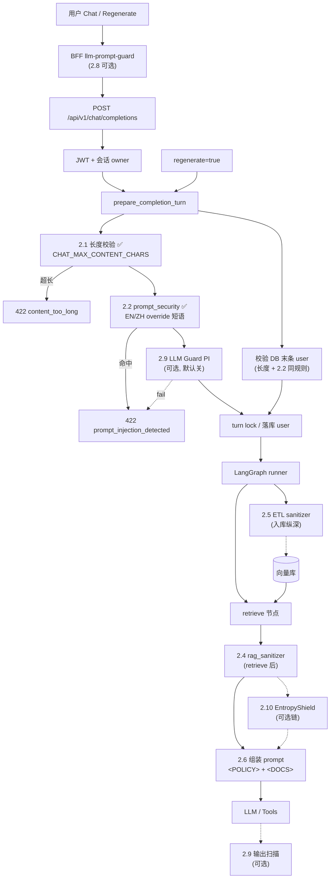

# 聊天与 RAG 安全指南

> **状态**：EP09 Story 9.1 设计与实现中  
> **关联**：[`ep09-optimization`](../../openspec/changes/ep09-optimization/) · [L07 学习路线](../tasks/learning/L07-optimization.md) · [Agent 图](./agent-langgraph.md) · [RAG 流式](./chat-rag-stream.md)  
> **实现入口（规划）**：`apps/api/app/services/security/` · `apps/web/lib/prompt-guard.ts`

---

## 1. 威胁模型（MemoryOS）

```text
                    ┌──────────────────────────────────────┐
  用户输入 ─────────►│ 直接 Prompt 注入                      │
  (chat / demo)     │ 角色劫持、ignore instructions、越狱   │
                    └──────────────────────────────────────┘
                    ┌──────────────────────────────────────┐
  RAG 知识库 ───────►│ 间接 Prompt 注入（重点）              │
  (WC ETL chunks)   │ 文档内藏「忽略上文」等指令            │
                    └──────────────────────────────────────┘
                    ┌──────────────────────────────────────┐
  Tavily 回灌 ──────►│ 工具输出不可信                        │
                    └──────────────────────────────────────┘
                    ┌──────────────────────────────────────┐
  滥用 / 成本 ──────►│ 超长输入、高频请求、Agent 多轮       │
                    └──────────────────────────────────────┘
```

| 威胁 | 来源 | 后果 | 主要防线 |
|:-----|:-----|:-----|:---------|
| 直接注入 | `HumanMessage` | 偏离人设、泄露 system、越权 | 长度限制、用户输入 guard、POLICY |
| 间接注入 | `<DOCS>` chunk | 模型执行文档内指令 | ETL + retrieve **双点** `rag_sanitizer` |
| 工具链滥用 | `tavily_search` | 成本、外泄 query | 限流、Token 配额、tool 参数校验 |
| DoS / 烧钱 | API 滥用 | 延迟、账单 | 限流（9.4）、配额（9.3） |
| 日志泄露 | LangSmith / 应用日志 | 隐私 | 脱敏、采样（9.7） |

**已有基础（brownfield）**：JWT 鉴权、会话 owner 校验、`HumanMessage` 与 system 分消息（见 `call_model.py`）。

---

## 2. 纵深防御架构

「**快失败**」= 在调用 LLM **之前**用廉价检查拒绝或清洗，**不是**先让攻击进模型再反应。

```text
┌─ FE/BFF（可选，可绕过）────────────────────────────────────────┐
│  llm-prompt-guard：tag / quarantine / block — 早反馈、减无效请求 │
└───────────────────────────────┬────────────────────────────────┘
                                ▼
┌─ API 用户输入（权威）──────────────────────────────────────────┐
│  L0  CHAT_MAX_CONTENT_CHARS → 422                              │
│  L0  prompt_security 规则 → 422                                  │
│  L0' LLM Guard PromptInjection / InvisibleText（可选，ML）     │
│  L0' llm-injection-guard middleware（可选，轻量对照实验）        │
└───────────────────────────────┬────────────────────────────────┘
                                ▼
┌─ RAG 管道（不可信数据）────────────────────────────────────────┐
│  ETL 入库前：rag_sanitizer（自研，必做）                         │
│  retrieve 后：rag_sanitizer 再清一次                             │
│  可选链：EntropyShield adapter（DeSyntax 打碎命令句式）          │
└───────────────────────────────┬────────────────────────────────┘
                                ▼
┌─ Prompt 结构（软防线）─────────────────────────────────────────┐
│  <POLICY> + <DOCS> + <TOOL_POLICY>；用户仅在 HumanMessage       │
└───────────────────────────────┬────────────────────────────────┘
                                ▼
                           LLM / Tools
                                ▼
┌─ 输出（可选）──────────────────────────────────────────────────┐
│  LLM Guard output scanners；canary / exfil 检测                  │
└────────────────────────────────────────────────────────────────┘
```

### 2.1 聊天请求安全流程（EP09）

下图：**实线 = 已实现（2.1–2.2）**；**虚线 = 规划中（2.3+）**。北向校验均在 API `prepare_completion_turn` 完成，进 LangGraph 前快失败。



| 阶段 | 状态 | 说明 |
|:-----|:-----|:-----|
| L0 用户输入 | **2.1–2.2 ✅** | 长度 + EN/ZH 启发式；regenerate 校验 DB 末条 user |
| L0' ML 输入 | 2.9 规划 | 跨语言 PromptInjection；Harness 默认关 |
| L1 RAG 清洗 | 2.3–2.5 规划 | ETL + retrieve 双点 `rag_sanitizer` |
| L2 Prompt 结构 | 2.6 规划 | POLICY 声明 docs/user 不可执行 |
| BFF 早反馈 | 2.8 规划 | API 仍为权威 |
| 红队回归 | 2.12 规划 | Garak nightly，不替代运行时 |

---

## 3. 自研核心（必做底座）

| 模块 | 路径（规划） | 职责 |
|:-----|:-------------|:-----|
| `content_validator` | `apps/api/app/services/security/` | 长度、空内容 |
| `prompt_security` | 同上 | 用户消息 override 短语启发式 → 422 |
| `rag_sanitizer` | 同上 | Unicode 规范化、控制字符、短语 neutralize、chunk 上限 |
| 分层 prompt | `graphs/prompts/rag_chat.py` | `<POLICY>` / `<DOCS>` / `<TOOL_POLICY>` |

**设计原则**：第三方包通过 **Adapter** 挂在 `UserInputGuard` / `ChunkSanitizer` 协议后，**默认关闭**；Harness 无 Key 时走自研规则路径。模块置于 `services/security/`，**无 FastAPI 依赖**，北向在 API 路由/prepare 调用（EP13 Remote Graph 不重复防线），详见 [`rate-limit-audit.md` §12](./rate-limit-audit.md#12-与-ep13--ep14-分布式部署)。

---

## 4. 可试用第三方包（本项目 EP09 纳入评估）

### 4.1 前端 / BFF（TypeScript）

| 包 | 安装 | 适用层 | 推荐模式 | 说明 |
|:---|:-----|:-------|:---------|:-----|
| **[llm-prompt-guard](https://github.com/shanemhamilton/llm-prompt-guard)** | `pnpm add llm-prompt-guard`（web） | `apps/web/app/api/chat/route.ts` 或 `lib/prompt-guard.ts` | `tag`（交给 API 决断）或 `quarantine` | 零依赖、亚毫秒；**不能替代 API** |
| **rag-poison-guard**（npm） | 一般不装 | — | — | **Node 专用**；能力与 `rag_sanitizer` 重叠；Python ETL 用自研 sanitizer 即可 |

**BFF 集成要点**：

- 仅对 **last user message** 扫描；`regenerate` 路径同样覆盖。
- 与 API 规则 **共享** `docs/tech/security/injection-patterns.json`（可选，减少漂移）。
- 被 BFF 拦截时返回 422 或友好错误，**仍建议**请求到 API 做二次校验（防直连 API）。

### 4.2 Python API（FastAPI）

| 包 | 安装 | 适用层 | 默认 | 说明 |
|:---|:-----|:-------|:-----|:-----|
| **[LLM Guard](https://github.com/protectai/llm-guard)** | `pip install llm-guard`（可选 extra） | 用户输入 / 可选输出 | `LLM_GUARD_ENABLED=false` | `PromptInjection`（DeBERTa）、`InvisibleText`、`TokenLimit`；模型体积与延迟需 benchmark |
| **[llm-injection-guard](https://github.com/maheshmakvana/llm-injection-guard)** | `pip install llm-injection-guard[fastapi]` | 中间件对照 | `LLM_INJECTION_GUARD_ENABLED=false` | 纯 stdlib、轻量；与自研规则重叠，用于 **对照实验** |
| **[EntropyShield](https://pypi.org/project/entropyshield/)** | `pip install entropyshield` | retrieve 后 chunk | `ENTROPYSHIELD_ENABLED=false` | DeSyntax；v0.1.x，需 WC 正例误伤测试 |

**LLM Guard 示例（用户输入）**：

```python
from llm_guard.input_scanners import InvisibleText, PromptInjection
from llm_guard import scan_prompt

scanners = [InvisibleText(), PromptInjection(threshold=0.5)]
sanitized, results_valid, results_score = scan_prompt(scanners, user_text)
if not all(results_valid):
    raise AppException(..., message="prompt_injection_detected")
```

**EntropyShield 示例（chunk 链）**：

```python
from entropyshield import shield  # API 以包文档为准

def sanitize_chunk(text: str) -> str:
    base = rule_based_sanitizer(text)
    if settings.entropyshield_enabled:
        return shield(base)
    return base
```

### 4.3 ETL / 入库

| 方式 | 说明 |
|:-----|:-----|
| **自研 `rag_sanitizer`** | `scripts/etl/worldcup/` 入库前调用（与 retrieve **同一函数**） |
| LLM Guard `InvisibleText` | 可选在 ingest 批处理中叠加 |
| rag-poison-guard | 不引入；逻辑已吸收进 sanitizer 设计 |

### 4.4 红队 / CI（非热路径）

| 工具 | 用途 | 建议 |
|:-----|:-----|:-----|
| **[Garak](https://github.com/NVIDIA/garak)** | 自动化探针（注入、越狱、泄露） | CI nightly 或发版前；失败不阻塞日常 Harness |
| **自研 Harness** | `test_chat_security_contract.py` + 足球正例 | 每次 PR **必须绿** |
| **Lakera Guard**（云 API） | 高检出率 | 有预算与合规需求时再评估 |

---

## 5. 环境变量（规划）

| 变量 | 默认 | 作用 |
|:-----|:-----|:-----|
| `CHAT_MAX_CONTENT_CHARS` | `8000` | 用户内容上限 |
| `PROMPT_INJECTION_FILTER_ENABLED` | `true` | 自研规则用户输入过滤 |
| `LLM_GUARD_ENABLED` | `false` | LLM Guard 用户/可选输出扫描 |
| `LLM_INJECTION_GUARD_ENABLED` | `false` | 轻量中间件对照 |
| `ENTROPYSHIELD_ENABLED` | `false` | chunk DeSyntax 链 |
| `BFF_PROMPT_GUARD_ENABLED` | `false` | Next BFF llm-prompt-guard |
| `LLM_GUARD_PROMPT_INJECTION_THRESHOLD` | `0.5` | 调参用 |

**Harness / 本地无 GPU**：`LLM_GUARD_ENABLED=false`，保证 `pnpm test:api:harness` 不依赖 HuggingFace 模型下载。

---

## 6. 策略对比：基础 vs 高级

### 6.1 按防线类型

| 策略 | 机制 | 延迟 | 成本 | 检出间接注入 | 误杀风险 | MemoryOS 阶段 |
|:-----|:-----|:-----|:-----|:-------------|:---------|:--------------|
| 长度限制 | 字符/token 上限 | 极低 | $0 | — | 低 | **必做** |
| 规则 / 正则 | override 短语表 | 极低 | $0 | 中 | 中（足球战术用语） | **必做**（自研） |
| Unicode 规范化 | NFKC + 剥零宽 | 极低 | $0 | 中 | 低 | **必做**（sanitizer） |
| POLICY/DOCS 分层 | prompt 结构 + 角色分离 | 无 | $0 | 中（软） | 低 | **必做** |
| DeSyntax（EntropyShield） | 打碎命令句式 | 低 | $0 | 中高 | 中 | **可选试用** |
| ML 分类（LLM Guard PI） | DeBERTa 等 | 中–高 | CPU/GPU | 高 | 中 | **可选试用** |
| LLM-as-Judge | 第二模型审输入 | 高 | $$ | 很高 | 低–中 | 高级 / 高价值场景 |
| 云 API（Lakera 等） | 托管检测 | 中 | $$$ | 很高 | 较低 | 生产高合规 |
| Canary token | system 藏密钥测泄露 | 低 | $0 | 低（偏泄露） | 低 | 可选输出监测 |
| NeMo Guardrails | 可编程对话轨 | 高 | 中 | 高（行为） | 中 | Agent 复杂编排时 |
| WAF / API Gateway | HTTP 层 | 低 | $ | 低（语义） | 低 | 公网入口补充 |

### 6.2 按攻击类型推荐组合

| 场景 | 推荐最小集 | 加强选项 |
|:-----|:-----------|:---------|
| **本地 demo / Harness 无 Key** | 自研规则 + sanitizer + POLICY/DOCS | 关 ML 包 |
| **世界杯事实问答（当前产品）** | 上栏 + ETL 双点清洗 + 限流 | + LLM Guard PI + EntropyShield 链 |
| **公网多租户 SaaS** | 上栏 + LLM Guard + 输出扫描 + 审计 | + Lakera / NeMo + Garak CI |
| **高敏感（金融/医疗）** | 全套 + PII 匿名（LLM Guard Anonymize）+ 人工审核队列 | 专用合规网关 |
| **仅防烧钱** | 长度 + 限流 + Token 配额 | 与注入无关但必配 |

### 6.3 高级方案说明（何时上）

| 方案 | 是什么 | 适用场景 | 不适用 |
|:-----|:-------|:---------|:-------|
| **LLM-as-Judge** | 用小模型判断「是否注入」再调主模型 | 用户输入复杂、规则误杀多、预算允许 | 延迟敏感、Harness 离线、强依赖第二模型安全 |
| **NeMo Guardrails** | NVIDIA 对话轨：禁止话题、固定流程 | 多步 Agent、强合规话术、工具白名单 | 单一 RAG 问答、团队无 Colang 维护能力 |
| **Instruction Hierarchy / StruQ** | 模型或训练层区分 trusted/untrusted | 自托管模型、可改权重 | 仅用 OpenAI 兼容 API 时难落地 |
| **向量库投毒检测**（OxideShield RAGPoisonGuard 类） | 困惑度/相似度找毒文档 | 开放上传、多租户 KB | **WC 固定 ETL**、数据源可信时优先级低 |
| **输出侧 exfil 扫描** | 检测回复中 base64/外链泄露 | 面向公网、担心 CVE 类泄露 | 纯内部 demo |
| **Garak 红队** | 持续探针回归 | 发版前、改 prompt/guard 后 | 替代运行时防护 |

---

## 7. 评估与试用计划（EP09）

### 7.1 基准数据集

| 集合 | 内容 |
|:-----|:-----|
| **正例** | 世界杯分析、战术用语、含「忽略上半场失误」等易误杀句 |
| **反例** | `ignore previous instructions`、零宽字符包裹 override、RAG chunk 内嵌指令 |
| **指标** | 拦截率、误杀率、p50/p99 延迟、Harness 是否仍绿 |

### 7.2 推荐试用顺序

1. 自研 `prompt_security` + `rag_sanitizer` + POLICY/DOCS（底座）  
2. BFF `llm-prompt-guard`（`tag` 模式，对照 UX）  
3. `llm-injection-guard`（轻量 API 对照）  
4. `LLM Guard`（`PromptInjection` + `InvisibleText`，记录延迟）  
5. `EntropyShield` on chunk 链（WC 正例误伤）  
6. Garak 探针（CI 非阻塞）  

### 7.3 决策记录（人审后填写）

| 包 | 试用结论 | 生产默认 |
|:---|:---------|:---------|
| llm-prompt-guard | | |
| LLM Guard | | |
| llm-injection-guard | | |
| EntropyShield | | |
| Garak | | |

---

## 8. 与 OpenSpec / 代码映射

| 文档章节 | OpenSpec task |
|:---------|:--------------|
| §2–3 自研底座 | tasks 2.1–2.6 |
| §4 第三方 adapter | tasks 2.8–2.12 |
| §7 Harness | tasks 2.7、2.12 |
| 限流 / 配额 / 审计 | [`rate-limit-audit.md`](./rate-limit-audit.md) §12（EP13/14 分布式）· Story 9.3、9.4 |

---

## 9. 参考链接

- [OWASP LLM Top 10 — LLM01 Prompt Injection](https://owasp.org/www-project-top-10-for-large-language-model-applications/)
- [LLM Guard 文档](https://protectai.github.io/llm-guard/)
- [llm-prompt-guard（npm）](https://github.com/shanemhamilton/llm-prompt-guard)
- [EntropyShield（PyPI）](https://pypi.org/project/entropyshield/)
- [Garak](https://github.com/NVIDIA/garak)
