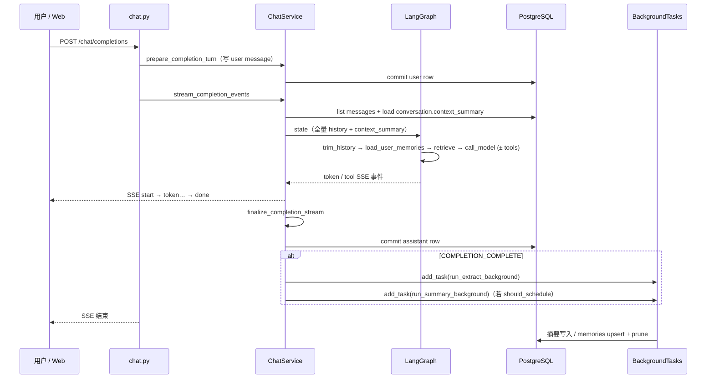
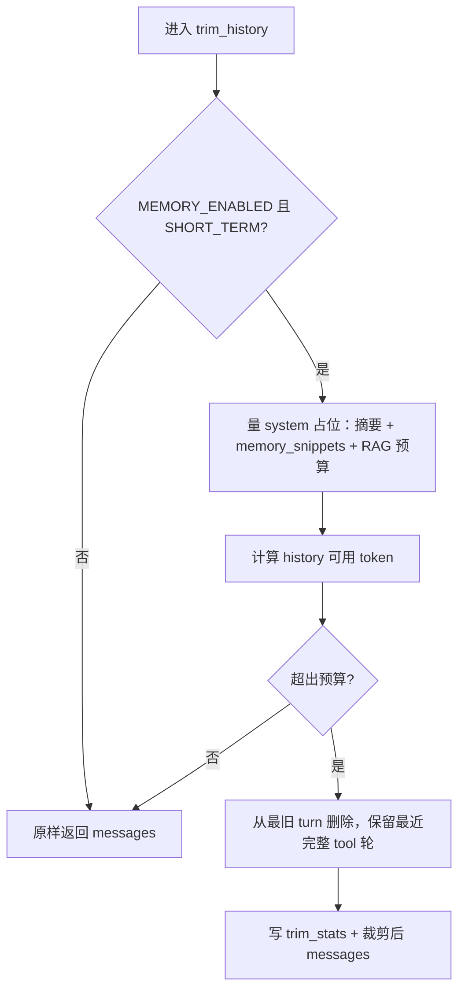
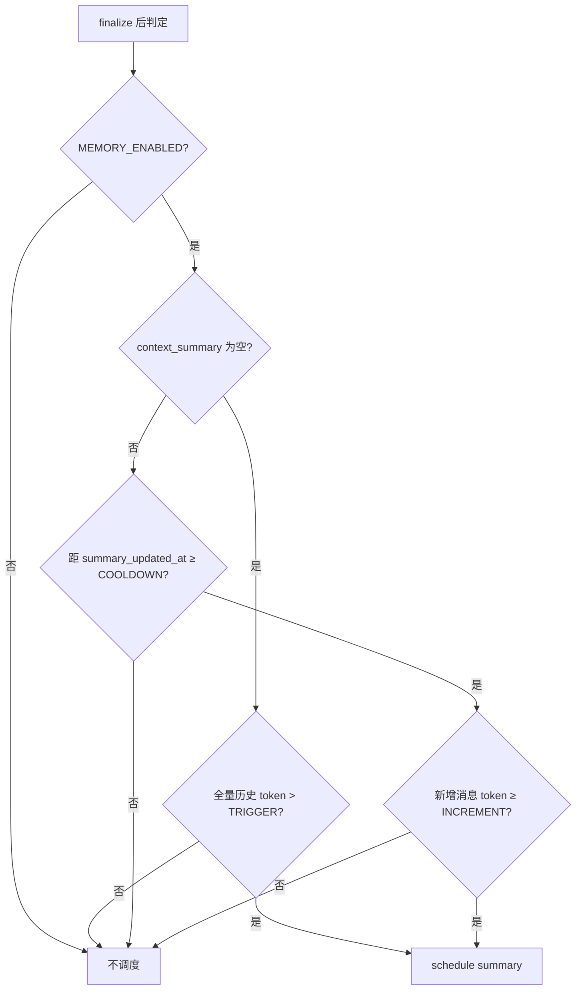
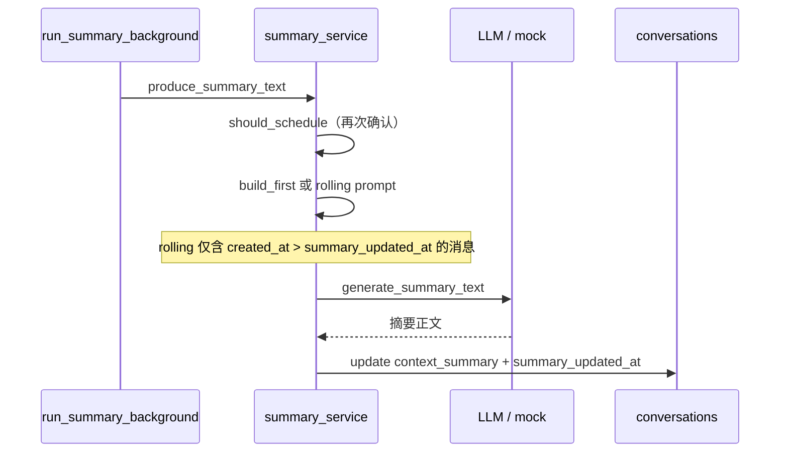
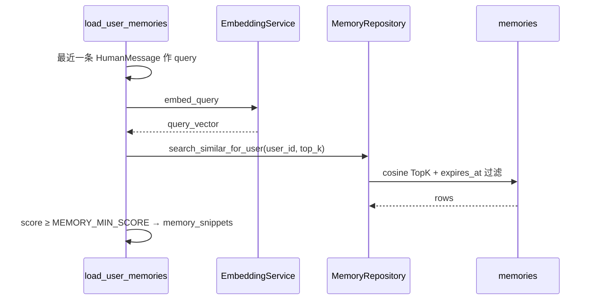
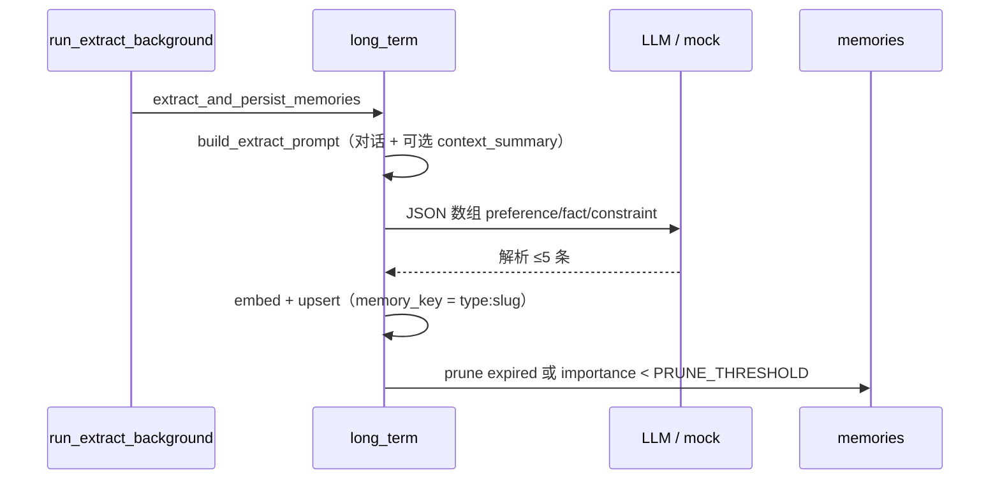
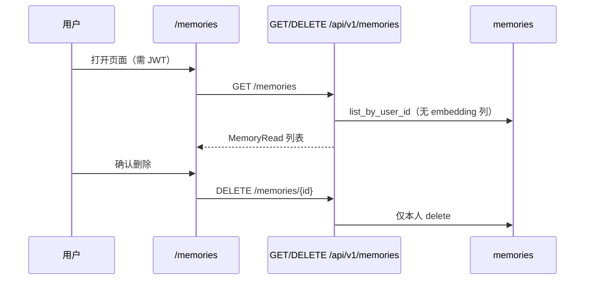

# EP06 记忆系统设计细节与时序

> 本文是 [memory-system.md](./memory-system.md) 的展开版：决策逻辑、数据流与时序图。  
> 权威决策记录见 [`openspec/changes/ep06-memory/design.md`](../../openspec/changes/ep06-memory/design.md)。

---

## 1. 单轮 completion 主路径

用户发消息 → SSE 流式回复 → 落库 →（可选）后台摘要与记忆抽取。



要点：

- **构图用 DB 全量**；裁剪只在图内 `trim_history` 写回 `state.messages`。
- `context_summary` 在 **本轮 stream 开始前** 从 `conversations` 读出；本轮后台刚写的摘要 **下一轮** 才生效。
- `BackgroundTasks` 在 **HTTP 响应体发完后** 执行（Starlette），不拖住 `done` 事件。

---

## 2. trim_history 与 token 预算



`short_term.trim_messages()` 保证：

- system 类注入块 **不裁**；
- 最近 user 消息及相邻 assistant/tool **优先保留**；
- DB `messages` 表 **不变**。

---

## 3. 会话摘要（中期记忆）

### 3.1 调度逻辑 `should_schedule_summary`



| 阶段 | 条件 |
|:-----|:-----|
| 首次 | 无摘要 **且** 全量历史 > `SUMMARY_TRIGGER_TOKENS` |
| 滚动 | 有摘要 **且** cooldown 已过 **且** `created_at > summary_updated_at` 的消息 token ≥ `SUMMARY_INCREMENT_TOKENS` |

### 3.2 生成与写入



---

## 4. 长期记忆

### 4.1 每轮检索 `load_user_memories`



`call_model` 将 snippets 格式化为 `## 用户长期记忆` system 块（与 RAG system **分层**，不混写）。

### 4.2 finalize 后抽取



抽取 **每轮 complete 都登记**（`MEMORY_LONG_TERM_ENABLED` 时）；与摘要节流独立。

---

## 5. ChatState 字段生命周期

| 字段 | 写入节点 | 消费位置 | 持久化 |
|:-----|:---------|:---------|:-------|
| `messages` | Service 构图；`trim_history` 写回裁剪结果 | 全图 | DB 全量 |
| `context_summary` | Service 从 DB 读入 | `trim_history`、`call_model` | `conversations` |
| `memory_snippets` | `load_user_memories` | `call_model` | 仅当轮 state |
| `trim_stats` | `trim_history` | 调试 / LangSmith（不暴露 SSE） | 无 |

---

## 6. ReAct 与 recursion_limit

EP06 每轮 tool 回路前固定经过 `trim_history`、`load_user_memories`、`retrieve_knowledge`（仅首轮从 START；`execute_tools` 后直连 `call_model`）。

单轮 tool 约需 6 步图节点；`runner._run_config` 在 `memory_enabled` 时将 `recursion_limit` 设为 `AGENT_MAX_ITERATIONS + 2`，避免默认 `5` 在一轮 tool 后触发 `GraphRecursionError`。

---

## 7. 前端「我的记忆」



聊天页 **不展示** memory chips（EP09 可考虑 phase UI）；记忆管理集中在 `/memories`。

---

## 8. Walkthrough 示例（小李 · 世界杯 · 第 36 轮）

用一条连续用例把三层记忆的 **计算 / 存储 / 取用 / 用户可见** 串起来。与 §1–§5 一致；图节点顺序为 `trim_history → load_user_memories → retrieve_knowledge → call_model`。

### 8.1 设定

| 项 | 值 |
|:---|:---|
| 用户 | 小李（JWT 登录） |
| 会话 | `conv-001`，已聊 **35 轮**（DB 约 70 条 user/assistant） |
| 已有中期记忆 | 第 20 轮 finalize 后后台写入 `context_summary`：「用户关注世界杯；偏好简洁…」 |
| 已有长期记忆 | `preference:style` →「偏好简洁、不要表格」（此前 finalize 后台抽取） |
| 本轮输入 | 「阿根廷对法国那场，按我之前的偏好再总结一下战术要点」 |

### 8.2 三层在本轮的分工

| 层 | 存哪 | 本轮何时算 | 本轮何时存 | 本轮何时用 | 用户可见 |
|:---|:-----|:-----------|:-----------|:-----------|:---------|
| **短期** | 不单独存；DB `messages` 全量 | `trim_history` 内对 **35 轮 messages** 做 token 预算与裁剪 | **不写 DB**（只写回 `state.messages`） | 同轮 `call_model` 前 | 聊天页 **全量 35 轮 + 新回复**；Header 提示「发送上下文裁剪在后端」 |
| **中期** | `conversations.context_summary` | **不算**（读 DB 已有摘要） | **不算**（后台任务在 **本轮 SSE 结束后** 才可能滚动更新） | 同轮：`trim_history` **扣摘要 token 预算**；`call_model` **整段注入** `[会话摘要]` | 聊天页 **不展示**摘要正文；行为上长聊仍「记得大意」 |
| **长期** | `memories` 表 | `load_user_memories`：**检索**（embed 本轮 user 句 → TopK）；finalize 后后台 **抽取** | 检索不写库；抽取在 **T5 后台** upsert | 同轮 `call_model` 注入 `## 用户长期记忆` | **`/memories` 列表**可管；聊天页 **不展示** chips |

**`trim_history` 与摘要的关系**：只 **裁剪 `messages`**；`context_summary` **不合并进 messages、不被 trim**，仅参与 `_reserved_prompt_tokens()`——摘要越长，能保留的最近轮越少（见 §2）。

### 8.3 完整时间线（第 36 轮）

```text
T0  小李在 /chat 输入问题 → POST /chat/completions

T1  prepare_completion_turn
    └─ user 消息写入 DB（聊天列表立刻 +1）

T2  stream_completion_events 开始
    ├─ DB 读：全量 35 轮 messages + context_summary（第 20 轮后写入的那份）
    └─ 组装 ChatState（messages 与 context_summary 为 **两个字段**）

T3  LangGraph（同一次 completion 内）
    ├─ trim_history
    │    · 输入：全量 messages + context_summary（仅计 token）
    │    · 输出：裁后的 messages（例如最近 ~8 轮）；DB messages **不变**
    ├─ load_user_memories
    │    · query = 最近 HumanMessage（本轮战术问题）
    │    · TopK 命中 preference:style 等 → memory_snippets（仅 state）
    ├─ retrieve_knowledge
    │    · RAG 世界杯知识块（与用户记忆 **读写分离**）
    └─ call_model
         · system 层叠：[会话摘要] + 长期记忆块 + RAG system
         · 再拼接裁后的 messages
    └─ SSE：start → token… → done

T4  finalize_completion_stream
    └─ assistant 回复写入 DB（用户看到完整新气泡）

T5  finalize 登记 BackgroundTasks（响应体尚未结束）
    ├─ run_extract_background（长期：可能 upsert 新 fact/preference）
    └─ run_summary_background（中期：**仅当** should_schedule_summary 为真）

T6  HTTP/SSE 响应结束 → BackgroundTasks 执行
    ├─ 可能 UPDATE context_summary（**下一轮** 提问才生效）
    └─ 可能 UPSERT memories + prune

T7  用户侧
    ├─ /chat：36 轮全量在列表；看不到摘要/注入明细
    └─ /memories：刷新后可能看到 T6 新抽取条目；可删除
```

### 8.4 与短聊、新会话的对比

| 场景 | 短期 | 中期 | 长期 |
|:-----|:-----|:-----|:-----|
| **短聊（5 轮，token < TRIGGER）** | 几乎不裁 | 可能 **永远没有** `context_summary` | 每轮 complete 仍可能后台抽取 |
| **新建会话 conv-002** | 新会话 messages 从空开始 | 摘要为空，重新走首次触发规则 | **同一 user_id**，检索仍可能命中「偏好简洁」 |

---

## 9. 当前设计的优点

| 维度 | 说明 |
|:-----|:-----|
| **架构清晰** | 短期 / 中期 / 长期三层职责分离；裁剪在图内、持久化在 Service、异步在 finalize 后，边界与 [BE 分层](../../apps/api/app/services/chat_service.py) 一致。 |
| **对外契约稳定** | DB 与消息列表 API **全量**；SSE 事件序与 EP05 一致；记忆能力对 BFF/前端 **透明**（仅多 `/memories` 管理面）。 |
| **可配置、可回滚** | `MEMORY_*` 开关 + token/摘要阈值；`MEMORY_ENABLED=false` 可整体回退 EP05 行为，适合灰度与事故止血。 |
| **与 RAG 隔离** | 用户记忆与世界杯知识库 **读写路径分离**，降低「用户偏好污染 RAG」「RAG 事实写入记忆」的耦合风险。 |
| **摘要节流** | increment + cooldown + rolling 增量输入，避免单会话长聊 **每轮调 summary LLM**（D3 产品约束）。 |
| **实现成本可控** | 单 LangGraph、无第二套编排；`memories` 表 + pgvector 复用现有 Embedding 栈；首版无 LlamaIndex 独立服务。 |
| **可测** | Harness 覆盖长历史 completion、memories API；单元测试覆盖 trim、摘要调度、抽取解析；mock LLM/Embedding 路径可 CI 回归。 |
| **用户可控** | 长期记忆可列表、删除；不强制在聊天页展示 chips，降低噪音（管理集中在 `/memories`）。 |

适合 **单团队 MVP、单区域部署、对话量中等** 的产品验证：能证明「长聊不炸 context」「跨轮偏好可沉淀」而不先引入完整 MLOps。

---

## 10. 当前设计的局限与权衡

| 局限 | 现象 / 风险 | 本 change 的取舍 |
|:-----|:------------|:-----------------|
| **`BackgroundTasks` 非持久队列** | 进程重启、多 Worker、滚动发布可能 **丢摘要/抽取**；无重试、死信、SLA | 首版不阻塞 SSE；企业级队列见 EP11 |
| **摘要 / 记忆滞后** | 后台任务在响应结束后才跑；用户连发消息时，**下一轮可能仍用旧摘要/旧记忆** | 接受「非热路径」；不牺牲首 token |
| **无记忆溯源** | 无法回答「这条记忆从哪句对话来」；幻觉抽取难追责 | `memory_key` upsert 覆盖，无 `source_message_id` / confidence |
| **抽取质量门禁弱** | LLM JSON 直写库；mock 确定性，真 LLM 仍可能幻觉；无人工确认流 | 用户可删 + importance 默认 0.5 + prune |
| **监控不足** | `trim_stats` 不进 SSE；无 Prometheus 级裁剪率、摘要失败率、抽取延迟 | 依赖 LangSmith；生产指标 EP11 |
| **无离线评测门禁** | 改 prompt/阈值可能 **静默退化**（摘要丢约束、裁剪过猛） | Harness 场景有限；体系化评测 EP12 |
| **单进程图** | 高并发时 LLM + embed + DB 同进程；无独立 memory worker 池 | EP13 多实例 / Remote Graph |
| **会话级摘要为主** | 跨会话「用户画像」主要靠 **长期记忆表**，而非全局 profile 服务 | 与 D4「跨会话事实」对齐，但无独立 Profile API |
| **ReAct 与裁剪交互复杂** | 多轮 tool 后仅 `call_model` 重入，不再 trim；依赖 `recursion_limit + 2` 补丁 | 需在 EP12 回归 tool 轮次场景 |
| **合规与多租户** | 无记忆分级、租户隔离、审计日志；删除会话与记忆 **无级联策略文档化** | 中型企业合规需 EP11 Story 11.2 扩展 |

这些是 **有意识的技术债**，不是实现疏漏；记录在 OpenSpec design 的 Risks 与 [post-mvp-roadmap](../tasks/post-mvp-roadmap.md)。

---

## 11. 与中型企业级 Memory 的差距

「中型企业」此处指：多团队共用平台、**7×24  SLA**、需审计与排障、记忆直接影响客服/销售话术，而非仅 demo 级长聊。

### 11.1 能力对照（EP06 MVP vs 常见企业期望）

| 能力域 | EP06 MVP | 中型企业常见期望 | 差距 |
|:-------|:---------|:-----------------|:-----|
| **任务可靠性** | `BackgroundTasks`，同进程 fire-and-forget | 持久队列、重试、死信、可查询失败任务 | **大** → EP11 |
| **可观测性** | LangSmith + 日志；无专用 metrics | 裁剪率、摘要滞后 P99、抽取失败率、注入条数 dashboards + 告警 | **大** → EP11 |
| **记忆溯源** | 仅 `memory_key` + content | `conversation_id` / `message_id` / `confidence` / 抽取版本 | **大** → EP11 |
| **质量评测** | 少量 Harness + 单元测试 | 固定评测集、发版回归、摘要约束召回、检索命中率 | **大** → EP12 |
| **冲突与版本** | 同 key upsert 覆盖 | 矛盾事实策略、superseded、人工审核队列 | **中** → EP11 |
| **权限与合规** | 用户 JWT 本人读写删 | 审计日志、数据保留策略、会话删除级联记忆、导出 | **中** |
| **多租户 / 隔离** | `user_id` 行级隔离 | 组织/项目级隔离、配额、跨用户禁止检索 | **中**（视行业） |
| **规模与成本** | 每轮 embed + 可选摘要/抽取 LLM | 批量 embed、抽取节流、缓存、独立 worker 扩缩容 | **中** → EP11/EP13 |
| **产品体验** | `/memories` 只读删；聊天无 chips | 记忆确认、编辑、来源跳转、会话内「为何引用这条记忆」 | **中** → EP09/前端 |
| **上下文策略** | trim + rolling summary + TopK 注入 | 分层记忆（工作/个人）、重要性动态排序、时间衰减可配置 | **小～中** |
| **与 Agent 编排** | 单图节点注入 | 子图热插拔、Remote Graph、多区域 | **中** → EP13 |

### 11.2 典型企业场景下的短板（举例）

1. **客服高峰 + 滚动发布**：finalize 已登记摘要任务，Pod 被杀掉 → 会话永远没有 `context_summary`，长聊仅靠 trim，**约束丢失风险上升**（企业会要求队列 + 至少一次投递）。
2. **销售「客户禁忌」写进 memory**：误抽取无法指向原话，合规追问时 **说不清来源**（企业会要求溯源字段 + 删除会话时级联处理）。
3. **改 `SUMMARY_TRIGGER_TOKENS` 上线**：无评测门禁，可能出现摘要过短丢「不要推荐竞品」类约束（企业会要求 EP12 回归 + 关键句规则）。
4. **多副本 API**：两实例同时跑同一用户抽取，依赖 DB upsert，一般可接受，但 **无任务幂等键与并发度量**（企业会要求任务 id + 监控）。
5. **安全评审**：记忆含 PII、无 retention 策略字段、无「仅 EU 区域存储」叙事（中型 SaaS 常卡在这一项，需产品与 schema 扩展，超出 EP06 scope）。

### 11.3 MVP 已覆盖、企业可暂缓项

- 基础 **长上下文不报错**（trim + reserve）。
- **跨会话偏好**（长期记忆 + 向量检索）。
- **用户自助删除**错误记忆。
- **与 RAG 知识库分离**（世界杯事实 vs 用户域）。
- **契约级回归**（Harness 49 项 + 长历史用例）。

结论：EP06 适合作为 **可演示、可迭代的记忆底座**；要达到中型企业「可运维、可解释、可审计、发版可回归」，需按 [EP11](../tasks/epics/EP11-memory-ops.md)（运维）、[EP12](../tasks/epics/EP12-memory-eval.md)（评测）、[EP13](../tasks/epics/EP13-memory-distributed.md)（规模）分批补齐，而非在单 change 内一次做完。

---

## 12. 与 EP11+ 的衔接

| 本 change（EP06） | 后续史诗 |
|:------------------|:---------|
| `BackgroundTasks` | EP11 异步队列、重试、监控 |
| 无离线评测集 | EP12 摘要/裁剪/抽取回归 |
| 单进程 LangGraph | EP13 Remote Graph / 多 Worker |

见 [post-mvp-roadmap.md](../tasks/post-mvp-roadmap.md)。
