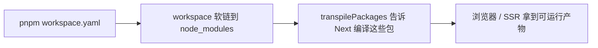

# Next.js 15 核心知识点复盘

> **收录版** · 深度追问答疑  
> **本项目版本**：`next@15.5.18`、`react@19.1.0`（`apps/web/package.json`）  
> **适用**：AI 全栈实战、面试复盘、前端工程化

---

## 一、核心基础特性（实战必用）

### 1. App Router 架构

Next.js **15.x** 稳定版核心架构，全面替代 Pages Router。

| 能力                   | 说明                                         |
| :--------------------- | :------------------------------------------- |
| **文件系统即路由**     | 目录映射 URL，零配置路由表                   |
| **嵌套布局复用**       | 布局切换不整页刷新；适合「侧栏 + 主内容」    |
| **RSC 与 Client 分离** | 默认 Server Component；交互用 `'use client'` |

**MemoryOS**：`app/layout.tsx` 作壳，`components/chat/*`（EP02）用 Client。

---

### 2. Server Actions

内置服务端 RPC；可与 FastAPI + SSE 并存（复杂流式仍走后端）。

| 点       | 说明                                       |
| :------- | :----------------------------------------- |
| 体验     | 少写 REST、同源无 CORS                     |
| React 19 | 表单、乐观更新                             |
| 部署     | 需 Node/Edge，**不能**纯静态 CDN（见 §四） |

---

### 3. 并行路由 & 拦截路由

模态框/抽屉可有独立 URL，刷新不丢、可分享、后退可关。  
**MemoryOS**：知识库预览、配置抽屉（EP04+）。

---

### 4. Turbopack（按版本对齐，避免背错）

> 详见 [vite-vs-turbopack.md](./vite-vs-turbopack.md)、[FE-engineering.md §3.1](../FE-engineering.md#31-turbopack-与-webpack按-nextjs-版本)

#### 官方演进表

| Next.js 版本                   | `next dev`                | `next build`                         |
| :----------------------------- | :------------------------ | :----------------------------------- |
| 15.0                           | Turbopack **稳定**（dev） | **Webpack 默认**                     |
| 15.3                           | Turbopack                 | build **实验性** `--turbopack`       |
| **15.5**（**本项目 15.5.18**） | `--turbopack`             | **`--turbopack` Beta**，**非默认**   |
| **16.0+**                      | Turbopack **默认**        | Turbopack **默认**；`--webpack` 回退 |

#### MemoryOS 当前脚本

```json
"dev": "next dev --turbopack",
"build": "next build"
```

| 命令                     | 15.5.18 实测表现                                |
| :----------------------- | :---------------------------------------------- |
| `next dev --turbopack`   | 日志含 `(Turbopack)` ✅                         |
| `next build`             | **Webpack** 生产构建（标题无 Turbopack）        |
| `next build --turbopack` | **Turbopack Beta** 生产构建（上线前需全量回归） |

**面试纠正**：勿说「Next 15 生产默认已是 Turbopack」——那是 **Next 16**；15.5 是 **dev 成熟 + 生产可选 Beta**。

---

## 二、四大渲染模式（实战选型）

| 模式    | 原理              | MemoryOS 示例             |
| :------ | :---------------- | :------------------------ |
| **SSG** | 构建时静态 HTML   | 宣传页、文档              |
| **SSR** | 每请求渲染        | 强实时个人页              |
| **ISR** | 缓存 + 按需再生   | 知识库/Agent 详情         |
| **PPR** | 静态壳 + 流动态区 | 聊天主界面（与 SSE 组合） |

**口诀**：多数 ISR；聊天 PPR + Client SSE；极高实时才 SSR。

---

## 三、关键 API 与原理

### 1. `useOptimistic`（React 19）

乐观 UI：先展示预期，成功合并，失败回滚。用于发消息先上屏等（EP02）。

### 2. RSC → 客户端时序

HTML 解析与 JS 下载**并行**；Hydration **串行后置**。实时消息首屏后可走 **SSE**（Client）。

### 3. ISR 惰性再生

过期后**首次访问**先旧缓存 + 后台新生成；可用 `revalidatePath` 主动失效。

### 4. PPR

`Suspense` 内外区分静/动态块；聊天外壳静态、消息流动态。

---

## 四、工程化与部署

### Server Actions

需 **Node.js / Edge**，MemoryOS 用 Docker + Node（EP08）。

### Turbopack + CI/CD（15.5.18）

- **开发**缓存：Turbopack dev 已有增量。
- **生产**：默认 Webpack build；若改用 `next build --turbopack`，CI 缓存策略需按 [官方说明](https://nextjs.org/docs/app/api-reference/turbopack#build-caching) 单独验证（filesystem cache 在 Next 16 更完善）。
- **升级 16 后**：build 默认 Turbopack，文档与脚本需重写。

---

## 五、实战避坑（MemoryOS）

| 规范     | 做法                                           |
| :------- | :--------------------------------------------- |
| **渲染** | ISR 为主；聊天 PPR/Client；强实时 SSR          |
| **数据** | 首屏 RSC；流式/Zustand 在 Client               |
| **构建** | **15.5**：dev `--turbopack`；prod 默认 Webpack |
| **状态** | 交互态仅在 `'use client'`                      |

---

## 附录：Monorepo 编译 — `transpilePackages` 与 `transpileWorkspaces`

> **本项目版本**：`next@15.5.18`  
> 配置见 `apps/web/next.config.ts`

### 一句话

**`transpilePackages`** 是 Next.js Monorepo 的**官方稳定能力**，强制 Next 编译 `node_modules` 里被 workspace 软链进来的本地包；没有它，公共包里的 TS/JSX/RSC 源码会直接报错。

**`transpileWorkspaces`** 常出现在社区笔记里，指「自动转译整个 workspace」的**理想配置**；在 **15.5.18 官方文档中并无与此等价的稳定选项**，实操仍以 **`transpilePackages` 手动列举包名** 为准（见下文对比）。

---

### 为什么必须有？（根因）

Next.js 有一条硬规则：**默认不转译 `node_modules` 里的代码**（假定 npm 包已是编译产物）。

Monorepo 里 `@memoryos/shared` 等是通过 `workspace:*` **软链**进 `node_modules` 的，里面往往是：

- 未编译的 `.ts` / `.tsx`
- 含 JSX、RSC 边界、Tailwind 等需走 Next 管道的源码

若不配置转译 → 浏览器/构建阶段出现 **Syntax Error**、**HMR 失效**、**生产 build 失败**。

---

### `transpilePackages` 实际做了什么？

不止「把 TS 编成 JS」，而是走 **完整 Next 编译流水线**：

| 步骤     | 说明                                            |
| :------- | :---------------------------------------------- |
| TS → JS  | SWC 转译                                        |
| JSX      | 按 Next/React 规则处理                          |
| RSC 边界 | 识别 Server / Client                            |
| 样式     | 与 PostCSS/Tailwind 等集成                      |
| 打包     | Tree-shaking、代码分割                          |
| 缓存     | 与 Turbopack/Webpack 增量缓存协同（dev 更明显） |

---

### 方式一：`transpilePackages`（全版本通用 · **本项目采用**）

```ts
// apps/web/next.config.ts — next@15.5.18
import type { NextConfig } from "next";

const nextConfig: NextConfig = {
  transpilePackages: ["@memoryos/shared", "@memoryos/ui"],
};

export default nextConfig;
```

| 项                | 说明                                                                                                   |
| :---------------- | :----------------------------------------------------------------------------------------------------- |
| 稳定性            | 自 Next **13.1+** 起为**稳定 API**（非 experimental）                                                  |
| 新增 workspace 包 | 必须**手动**把包名加入数组                                                                             |
| 通配符            | **不支持** `*` / 自动扫描整个 `packages/*`                                                             |
| 官方文档          | [transpilePackages](https://nextjs.org/docs/app/api-reference/config/next-config-js/transpilePackages) |

**MemoryOS 新增包时 checklist**：

1. 在 `packages/xxx` 创建包并在 `pnpm-workspace.yaml` 声明
2. `apps/web/package.json` 增加 `"@memoryos/xxx": "workspace:*"`
3. **`next.config.ts` 的 `transpilePackages` 数组加上 `"@memoryos/xxx"`**
4. 根目录 `pnpm install`，重启 `pnpm dev:web`

---

### 方式二：`transpileWorkspaces`（社区说法 · 版本对齐）

部分教程/笔记会写：

```ts
// ⚠️ 以下为「期望 API」写法，勿在 15.5.18 上假设一定生效
const nextConfig = {
  experimental: {
    transpileWorkspaces: true,
  },
};
```

**含义（概念层）**：

- 希望 **自动** 转译 pnpm/npm workspace 内所有本地包
- 免维护 `transpilePackages` 长列表，新增包「一劳永逸」

**与官方现状的对照（面试/实操必背）**：

| 维度     | `transpilePackages` | `transpileWorkspaces`（笔记中的说法）    |
| :------- | :------------------ | :--------------------------------------- |
| 文档地位 | ✅ 稳定、有专页     | ❌ **15.5.18 无对应稳定文档项**          |
| 配置方式 | 枚举包名字符串数组  | 布尔或 experimental 开关（非官方标准）   |
| 新增包   | 改 config 列表      | 笔记称「自动」                           |
| MemoryOS | **已配置**          | **未使用**（避免构建行为不确定）         |
| 推荐     | **生产可用**        | 仅作了解；升级 Next 时再查 Release Notes |

若在别的文章里看到 `transpileWorkspaces`：

1. 先查对方写的 **Next 小版本** 与 **官方 changelog**
2. 本机用 `next build` 验证，不要照抄 experimental
3. 对外表述：**「我们 Monorepo 用官方 `transpilePackages` 显式列出 workspace 包，行为可预期」**

> 升级到 **Next 16+** 时重新查文档：若未来提供 workspace 级自动转译，再评估是否替换手动列表。

---

### 必知避坑

| ❌ 不要                                                        | ✅ 应该                        |
| :------------------------------------------------------------- | :----------------------------- |
| 给 `@memoryos/shared` 单独跑一套 `tsc build` 再给 Next 用 dist | 导出**源码**，让 Next 统一编译 |
| 在 FastAPI 侧配置 `transpilePackages`                          | **仅** `apps/web` 需要         |
| 只配 `workspace:*` 不写 `transpilePackages`                    | 两者**缺一不可**               |
| 假设 `transpileWorkspaces: true` 已生效而不测                  | 以 **build + dev 实测** 为准   |

---

### 与 `pnpm workspace` 的关系



| 能力                    | 作用                         | 缺失后果                            |
| :---------------------- | :--------------------------- | :---------------------------------- |
| **`workspace:*` 依赖**  | 用包名引用本地代码，版本统一 | 只能相对路径 `../../packages`，易乱 |
| **`transpilePackages`** | 让 Next **编译**本地包源码   | 语法错误、热更新坏、build 挂        |

---

### 面试 / 复述模板（30 秒）

> 我们 Monorepo 用 pnpm workspace 引用 `@memoryos/shared` 和 `@memoryos/ui`。Next 默认不编译 node_modules，所以必须在 **next@15.5.18** 的 `next.config.ts` 里配置 **`transpilePackages` 数组** 列出每个包名。  
> 社区里说的 **`transpileWorkspaces` 自动扫全 workspace** 在 15.5 官方并不是可依赖的稳定 API，我们为了可预期性用手动列表。后端 FastAPI 不需要这项配置。

---

## 相关文档

- [FE-engineering.md](../FE-engineering.md) — Monorepo 与 ESLint 共享规则
- [vite-vs-turbopack.md](./vite-vs-turbopack.md)

Next.js 核心基础知识点汇总（AI 项目必备）
一、基础工具链详解

1. next/font 字体优化
   核心作用：内置字体加载器，零配置实现字体优化，解决 FOIT（闪烁）、FOUT（无样式文本）问题。
   自动托管：将 Google Fonts 下载到本地，无需外部请求，提升隐私和速度
   自动子集化：只打包页面用到的字符，大幅减小字体文件体积
   零布局偏移：自动计算字体尺寸，避免页面跳动
   用法示例:

   ```tsx
   // app/layout.tsx
   import { Inter } from "next/font/google";
   const inter = Inter({ subsets: ["latin"] });

   export default function RootLayout({ children }) {
     return <html className={inter.className}>{children}</html>;
   }
   ```

2. Metadata API 元数据管理
   核心作用：统一管理页面 SEO 元数据，支持静态和动态生成。
   静态元数据：直接在页面导出 metadata 对象
   动态元数据：通过 generateMetadata 函数根据路由参数生成
   自动继承：子页面会继承父布局的元数据，也可以覆盖
   用法示例：

   ```tsx
   // app/knowledge/[id]/page.tsx
   export async function generateMetadata({ params }) {
     const kb = await getKnowledgeBase(params.id);
     return {
       title: `${kb.name} - MemoryOS 知识库`,
       description: kb.description,
     };
   }
   ```

3. 环境变量 `NEXT_PUBLIC_` 规则
   | 类型 | 前缀 | 访问位置 | 暴露范围 | 适用场景 |
   | ---- | ---- | ---- | ---- | ---- |
   | 客户端环境变量 | `NEXT_PUBLIC_` | 客户端组件 + 服务端组件 | 会暴露给浏览器 | 公开的 API 地址、域名、配置 |
   | 服务端环境变量 | 无前缀 | 仅服务端组件、Server Actions、API 路由 | 不会暴露给浏览器 | 数据库密码、OpenAI API Key、JWT 密钥 |
   关键规则：
   环境变量文件必须放在项目根目录：.env.local（本地开发）、.env.production（生产）
   服务端环境变量绝对不能加 `NEXT_PUBLIC_` 前缀，否则会泄露到客户端
   RSC 运行在服务端，可以安全读取所有环境变量（包括私密 key）

二、浏览器请求 / → Next.js 渲染链路简图

```
    用户输入 URL → 浏览器发送 GET / 请求
    ↓
    Next.js 服务器接收请求
    ↓
    匹配路由 → 找到对应的 page.tsx 和 layout.tsx
    ↓
    执行所有服务端组件（RSC）
    → 查询数据库/调用 API 获取数据
    → 渲染静态 HTML
    → 序列化数据嵌入 HTML
    ↓
    生成完整 HTML 流 → 发送给浏览器
    ↓
    浏览器并行执行：
```

3. 解析 HTML → 显示静态内容（首屏）
4. 下载客户端组件 JS 代码
   ↓
   JS 下载完成 → 执行水合（Hydration）
   → 激活客户端组件交互
   → 挂载初始状态
   ↓
   页面完全可交互

三、核心问题解答

5. App Router 和 Pages Router 核心区别？为什么新项目选 App Router？
   核心区别：
   | 维度 | Pages Router | App Router |
   | ---- | ---- | ---- |
   | 架构 | 基于文件的路由，每个页面是一个独立组件 | 基于文件夹的路由，支持嵌套布局、并行路由 |
   | 渲染能力 | 仅支持 SSR/SSG/ISR | 支持 RSC / 客户端组件分离、PPR 部分预渲染 |
   | 数据获取 | 只能在页面级别获取数据（getServerSideProps/getStaticProps） | 任意组件级别获取数据，支持流式数据 |
   | 状态管理 | 所有组件都是客户端组件，JS 包体积大 | 默认服务端组件，仅交互组件需要客户端 JS |
   | 开发体验 | 简单但功能有限 | 功能强大，支持复杂交互和架构 |

为什么新项目选 App Router：
性能更好：RSC 大幅减少客户端 JS 体积，首屏速度提升 3-5 倍
功能更强：嵌套布局、并行路由、拦截路由、PPR 等特性，完美适配 AI 项目
官方推荐：Vercel 已经将 App Router 作为默认架构，Pages Router 进入维护模式
未来趋势：所有新特性（Turbopack、Cache Components）都只支持 App Router

6. RSC 是什么？为什么能减小客户端 JS？Hydration 发生在什么时候？
   RSC（React Server Components）：运行在服务端的 React 组件，代码永远不会发送到客户端。
   工作原理：RSC 在服务端渲染成 HTML 和 JSON 指令，发送给浏览器后，客户端组件会根据这些指令拼接成完整的 DOM
   为什么能减小客户端 JS：
   非交互的静态内容（标题、文本、图片）都在服务端渲染，不需要发送对应的 JS 代码
   只有需要交互的组件（按钮、输入框、聊天窗口）才会发送 JS 到客户端
   可以在服务端直接调用数据库、API，不需要把这些逻辑暴露给客户端
   Hydration（水合）发生在什么时候：
   浏览器下载完客户端组件的 JS 代码后开始执行
   水合过程会将静态 HTML 转换为可交互的 React 组件
   水合不会阻塞用户看到静态内容，用户可以先看到页面，再等待交互功能激活
7. `NEXT_PUBLIC_` 和普通 env 有什么区别？能否在 RSC 里读私密 key？
   核心区别：
   `NEXT_PUBLIC_` 前缀的环境变量会被 Next.js 嵌入到客户端 JS 包中，所有访问网站的用户都可以看到
   无前缀的环境变量只会存在于服务端，永远不会发送到客户端
   能否在 RSC 里读私密 key：完全可以，而且这是最佳实践
   RSC 运行在服务端，代码永远不会暴露给浏览器
   可以在 RSC 中安全读取数据库密码、API Key 等敏感信息
   绝对不要在客户端组件中读取私密 key，即使没有加 `NEXT_PUBLIC_` 前缀也不行
   正确示例：
   tsx
   // ✅ 正确：RSC 中读取私密 key
   export default async function ChatPage() {
   // 安全，这段代码永远不会发送到客户端
   const openai = new OpenAI({ apiKey: process.env.OPENAI_API_KEY });
   const response = await openai.chat.completions.create({...});
   return <div>{response.choices[0].message.content}</div>;
   }

// ❌ 错误：客户端组件中读取私密 key
'use client';
export default function ChatClient() {
// 危险！OPENAI_API_KEY 会泄露给所有用户
const openai = new OpenAI({ apiKey: process.env.OPENAI_API_KEY });
}
