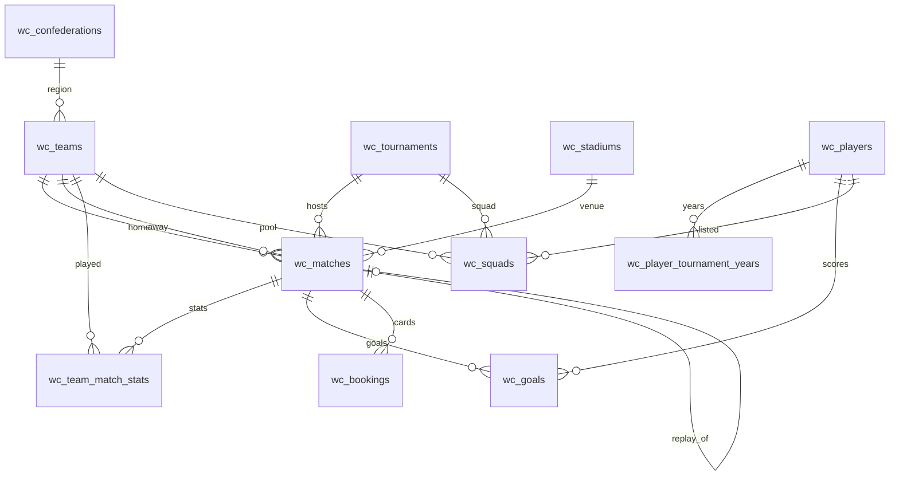

# World Cup Silver 数据模型（`wc_*`）

> **真相源**：Alembic `003`–`006`（`apps/api/alembic/versions/`）与 ORM `app/models/worldcup/`。  
> Bronze CSV 见 `data/bronze/worldcup/`；校验见 `scripts/etl/worldcup/validate.py`。

---

## 架构

```text
Bronze CSV  →  scripts/etl/worldcup/run.py  →  PostgreSQL wc_*  →  Gold fact_cards（EP04-01.6）
```

**加载顺序**：`dimensions` → `players` → `matches` → `events`

---

## ER 图（Silver V1）



---

## 表清单

| 表 | 迁移 | 行数（全量） | 主键 |
| :--- | :---: | ---: | :--- |
| `wc_confederations` | 003 | 6 | `id` (CF-*) |
| `wc_teams` | 003 | 88 | `id` (T-*) |
| `wc_tournaments` | 003 | 30 | `id` (WC-*) |
| `wc_stadiums` | 003 | 240 | `id` (S-*) |
| `wc_players` | 004 | 10,401 | `id` (P-*) |
| `wc_player_tournament_years` | 004 | 13,843 | `(player_id, year)` |
| `wc_matches` | 005 | 1,248 | `id` (M-*) |
| `wc_team_match_stats` | 005 | 2,496 | `(match_id, team_id)` |
| `wc_goals` | 006 | 3,637 | `id` (G-*) |
| `wc_squads` | 006 | 13,843 | `(tournament_id, team_id, player_id)` |
| `wc_bookings` | 006 | 3,178 | `id` (B-*) |

---

## 维度表

### `wc_confederations`

| 列 | 类型 | 说明 |
| :--- | :--- | :--- |
| `id` | TEXT PK | 如 `CF-1` |
| `name` | TEXT | 足联名称 |
| `code` | TEXT | AFC、UEFA 等 |
| `wikipedia_link` | TEXT NULL | 清洗后 URL |

### `wc_teams`

| 列 | 类型 | 说明 |
| :--- | :--- | :--- |
| `id` | TEXT PK | `T-03` |
| `name` / `code` | TEXT | 队名、三字码 |
| `mens_team` / `womens_team` | BOOL | 男子/女子国家队标志 |
| `confederation_id` | FK | → `wc_confederations` |
| `federation_name` / `region_name` | TEXT NULL | 足协、大区 |
| `*_wikipedia_link` | TEXT NULL | `not applicable` → NULL |

### `wc_tournaments`

| 列 | 类型 | 说明 |
| :--- | :--- | :--- |
| `id` | TEXT PK | `WC-2022` |
| `slug` | TEXT UK | `wc2022`（EP11 API 对齐） |
| `year` | INT | 赛会年份 |
| `start_date` / `end_date` | DATE | |
| `host_country` / `winner` | TEXT NULL | |
| `host_won` | BOOL | |
| `count_teams` | INT NULL | |
| `group_stage` … `final` | BOOL | 当届赛制标志 |

### `wc_stadiums`

| 列 | 类型 | 说明 |
| :--- | :--- | :--- |
| `id` | TEXT PK | `S-147` |
| `name` / `city_name` / `country_name` | TEXT | |
| `capacity` | INT NULL | |

---

## 球员

### `wc_players`

| 列 | 类型 | 说明 |
| :--- | :--- | :--- |
| `id` | TEXT PK | `P-03484` |
| `family_name` / `given_name` | TEXT | |
| `display_name` | TEXT | `given + family` |
| `birth_date` | DATE NULL | `not available` → NULL |
| `female` | BOOL | |
| `positions` | TEXT[] | GK/DF/MF/FW |
| `primary_position` | TEXT NULL | 首个为 1 的位置 |
| `count_tournaments` | INT | 与桥表行数校验 |

### `wc_player_tournament_years`

| 列 | 类型 | 说明 |
| :--- | :--- | :--- |
| `player_id` | FK PK | |
| `year` | INT PK | 来自 `list_tournaments` 年份 |

---

## 比赛

### `wc_matches`

| 列 | 类型 | 说明 |
| :--- | :--- | :--- |
| `id` | TEXT PK | `M-2022-64` |
| `tournament_id` | FK | |
| `name` | TEXT | 对阵标题 |
| `stage_name` / `group_name` | TEXT | 阶段、小组 |
| `is_replayed` / `is_replay` | BOOL | 重赛标志 |
| `replay_of_match_id` | FK NULL | 自引用，重赛场 → 原场 |
| `match_date` / `match_time` | DATE / TEXT | |
| `stadium_id` | FK | |
| `home_team_id` / `away_team_id` | FK | |
| `home_score` / `away_score` | INT | 常规+加时比分 |
| `extra_time` / `penalty_shootout` | BOOL | |
| `home_penalty_score` / `away_penalty_score` | INT NULL | 点球大战 |

### `wc_team_match_stats`

球队视角（来源 `team_appearances.csv`），每场 **2 行**。

| 列 | 类型 | 说明 |
| :--- | :--- | :--- |
| `match_id` + `team_id` | PK | |
| `opponent_id` | FK | |
| `is_home` | BOOL | |
| `goals_for` / `goals_against` | INT | 与 `wc_matches` 交叉校验 |
| `won` / `lost` / `drew` | BOOL | |

---

## 事件

### `wc_goals`

| 列 | 类型 | 说明 |
| :--- | :--- | :--- |
| `id` | TEXT PK | `G-*` |
| `match_id` / `tournament_id` | FK | |
| `team_id` | FK | 计分方（含乌龙受益队） |
| `player_id` / `player_team_id` | FK | 进球球员 / 球员当时所属队 |
| `minute_regulation` / `minute_stoppage` | INT | |
| `match_period` | TEXT | 最长 38 字符 |
| `own_goal` / `penalty` | BOOL | |

### `wc_squads`

当届大名单；PK `(tournament_id, team_id, player_id)`。

### `wc_bookings`

红黄牌；`yellow_card` / `red_card` / `second_yellow_card` / `sending_off` 为 BOOL。

---

## 校验

```bash
# 全库行数 + FK + 业务规则
bash scripts/api.sh exec python ../../scripts/etl/worldcup/validate.py

# 2022 男子世界杯黄金集
bash scripts/api.sh exec python ../../scripts/etl/worldcup/validate.py --tournament WC-2022
```

## Gold 事实卡

```bash
bash scripts/api.sh exec python ../../scripts/etl/worldcup/fact_cards.py
bash scripts/api.sh exec python ../../scripts/etl/worldcup/fact_cards.py --tournament WC-2022
```

输出：`data/gold/worldcup/fact_cards/{matches,players,tournaments,samples}.jsonl`。  
详见 [`data/gold/worldcup/README.md`](../../data/gold/worldcup/README.md)。

黄金集 `WC-2022`：64 场、172 球、831 名单、决赛 `M-2022-64` 比分 3–3。

---

## 未入库（V1 跳过）

| Bronze 文件 | 原因 |
| :--- | :--- |
| `goals-by-minute-summary.csv` 等 L6 汇总 | 可由 SQL 重算 |
| `player_appearances` / `substitutions` 等 | P2，后续 change |

---

## 相关文档

- [EP04-01 史诗](../tasks/epics/EP04-01-worldcup-data-etl.md)
- [规划方案](../superpowers/specs/2026-06-03-worldcup-bronze-etl-plan.md)
- [Bronze README](../../data/bronze/worldcup/README.md)
